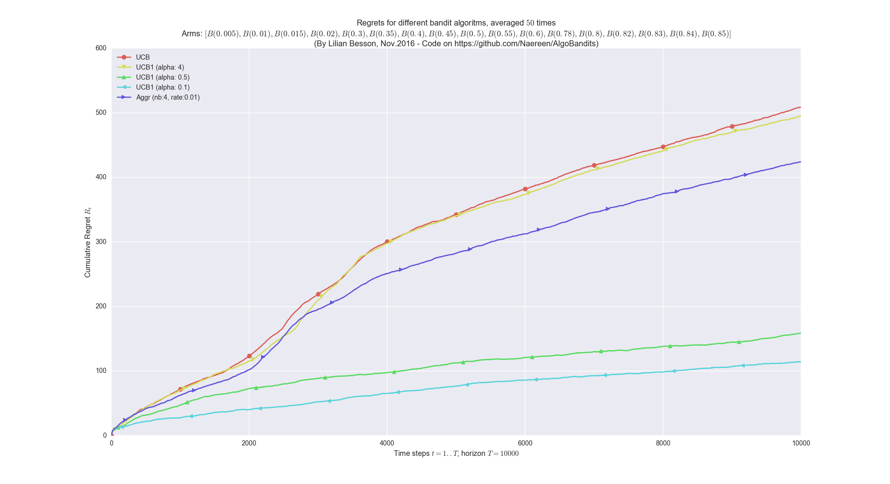
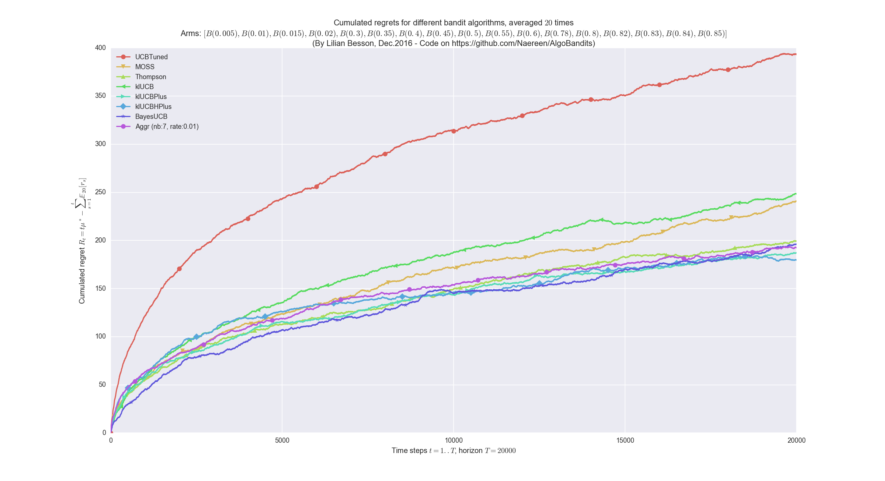
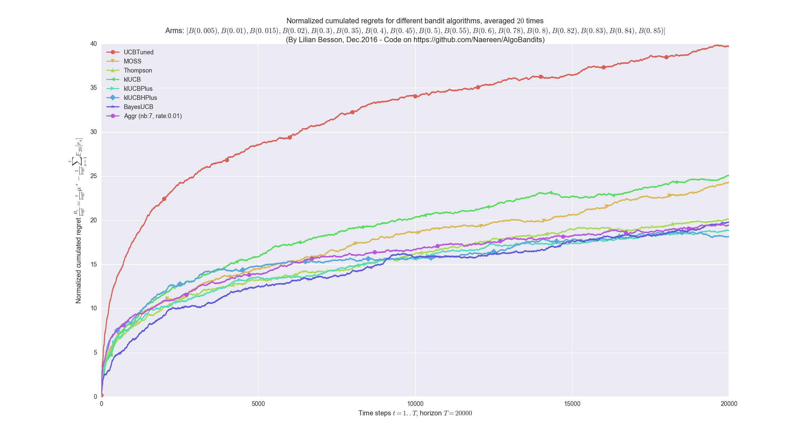

## 1st contribution: The **policy aggregation algorithm**

### More mathematical explanations
Initially, every child algorithms `A_i` has the same "trust" probability `p_i`, and at every step, the aggregated bandit first listen to the decision from all its children `A_i` (`a_{i,t}` in `1 .. K`), and then decide which arm to select by a probabilistic vote: the probability of selecting arm `k` is the sum of the trust probability of the children who voted for arm `k`.
It could also be done the other way: the aggregated bandit could first decide which children to listen to, then trust him.

But we want to update the trust probability of all the children algorithms, not only one, when it was wised to trust them.
Mathematically, when the aggregated arm choose to pull the arm `k` at step `t`, if it yielded a positive reward `r_{k,t}`, then the probability of all children algorithms `A_i` who decided (independently) to chose `k` (i.e., `a_{i,t} = k`) are increased multiplicatively: `p_i <- p_i * exp(+ beta * r_{k,t})` where `beta` is a positive *learning rate*, e.g., `beta = 0.1`.

It is also possible to decrease multiplicatively the trust of all the children algorithms who did not decided to chose the arm `k` at every step `t`: if `a_{i,t} != k` then `p_i <- p_i * exp(- beta * r_{k,t})`. I did not observe any difference of behavior between these two options (implemented with the Boolean parameter `updateAllChildren`).

### Ensemble voting for MAB algorithms
This algorithm can be seen as the Multi-Armed Bandits (i.e., sequential reinforcement learning) counterpart of an *ensemble voting* technique, as used for classifiers or regression algorithm in usual supervised machine learning (see, e.g., [`sklearn.ensemble.VotingClassifier`](http://scikit-learn.org/stable/modules/generated/sklearn.ensemble.VotingClassifier.html#sklearn.ensemble.VotingClassifier) in [scikit-learn](http://scikit-learn.org/)).

Another approach could be to do some sort of [grid search](http://scikit-learn.org/stable/modules/grid_search.html).

----

## Configuration:
A simple python file, [`configuration.py`](configuration.py), is used to import the [arm classes](Arms/), the [policy classes](Policies/) and define the problems and the experiments.

For example, this will compare the classical MAB algorithms [`UCB`](Policies/UCB.py), [`Thompson`](Policies/Thompson.py), [`BayesUCB`](Policies/BayesUCB.py), [`klUCB`](Policies/klUCB.py), and the less classical [`AdBandit`](Policies/AdBandit.py) algorithms.

```python
configuration = {
    "horizon": 10000,    # Finite horizon of the simulation
    "repetitions": 100,  # number of repetitions
    "n_jobs": -1,        # Maximum number of cores for parallelization: use ALL your CPU
    "verbosity": 5,      # Verbosity for the joblib calls
    # Environment configuration, you can set up more than one.
    "environment": [
        {
            "arm_type": Bernoulli,  # Only Bernoulli is available as far as now
            "probabilities": [0.01, 0.01, 0.01, 0.02, 0.02, 0.02, 0.05, 0.05, 0.05, 0.1]
        }
    ],
    # Policies that should be simulated, and their parameters.
    "policies": [
        {"archtype": UCB, "params": {} },
        {"archtype": UCBV, "params": {} },
        {"archtype": UCBTuned, "params": {} },
        {"archtype": MOSS, "params": {} },
        {"archtype": Thompson, "params": {} },
        {"archtype": klUCB, "params": {} },
        {"archtype": klUCBPlus, "params": {} },
        {"archtype": klUCBHPlus, "params": {} },
        {"archtype": BayesUCB, "params": {} },
        {"archtype": AdBandit, "params": {
                "alpha": 0.5, "horizon": 10000  # AdBandit require to know the horizon
        } }
    ]
}
```

To add an aggregated bandit algorithm ([`Aggr` class](Policies/Aggr.py)), you can use this piece of code, to aggregate all the algorithms defined before and dynamically add it to `configuration`:
```python
current_policies = configuration["policies"]
configuration["policies"] = current_policies +
    [{  # Add one Aggr policy, from all the policies defined above
        "archtype": Aggr,
        "params": {
            "learningRate": 0.05,  # Tweak this if needed
            "updateAllChildren": True,
            "children": current_policies,
        },
    }]
```

----

## [How to run the experiments ?](How_to_run_the_code.md)
*First*, install the requirements:
```bash
pip install -r requirements.txt
```

*Then*, it should be very straight forward to run some experiment.
This will run the simulation, average them (by `repetitions`) and plot the results:
```bash
python main.py
```

### In a [`virtualenv`](https://virtualenv.pypa.io/en/stable/) ?
If you prefer to not install the requirements globally on your system-wide Python setup, you can (and should) use [`virtualenv`](https://virtualenv.pypa.io/en/stable/).

```bash
$ virtualenv .
Using base prefix '/usr'
New python executable in /your/path/to/AlgoBandits/bin/python3
Also creating executable in /your/path/to/AlgoBandits/bin/python
Installing setuptools, pip, wheel...done.
$ source bin/activate  # in bash, use activate.csh or activate.fish if needed
$ type pip  # just to check
pip is /your/path/to/AlgoBandits/bin/pip
$ pip install -r requirements.txt
Collecting numpy (from -r requirements.txt (line 5))
...
Installing collected packages: numpy, scipy, cycler, pytz, python-dateutil, matplotlib, joblib, pandas, seaborn, tqdm, sphinx-rtd-theme, commonmark, docutils, recommonmark
Successfully installed commonmark-0.5.4 cycler-0.10.0 docutils-0.13.1 joblib-0.11 matplotlib-2.0.0 numpy-1.12.1 pandas-0.19.2 python-dateutil-2.6.0 pytz-2016.10 recommonmark-0.4.0 scipy-0.19.0 seaborn-0.7.1 sphinx-rtd-theme-0.2.4 tqdm-4.11.2
```

And then be sure to use the virtualenv binary for Python, `bin/python`, instead of the system-wide one, to launch the experiments (the Makefile should use it by default, if `source bin/activate` was executed).

### Or with a [`Makefile`](Makefile) ?
You can also use the provided [`Makefile`](Makefile) file to do this simply:
```bash
make install  # install the requirements
make single   # run and log the main.py script
```

### Or within a [Jupyter notebook](https://jupyter.org/) ?
> I am writing some [Jupyter notebooks](https://jupyter.org/), in [this folder (`notebooks/`)](notebooks/), so if you want to do the same for your small experiments, you can be inspired by the few notebooks already written.

----

## Some illustrations
Here are some plots illustrating the performances of the different [policies](Policies/) implemented in this project, against various problems (with [`Bernoulli`](Arms/Bernoulli.py) arms only):

### Small tests
[](plots/5_tests_AdBandit__et_Aggr.png)
[](plots/2000_steps__100_average.png)

### Larger tests
- 4 different [`Aggr`](Policies/Aggr.py) on 6 policies:
[](plots/10000_steps__50_repetition_6_policies_4_Aggr.png)
- 1 [`Aggr`](Policies/Aggr.py) performing very well:
[](plots/10000_steps__50_repetition_6_policies_with_Softmax_1_Aggr.png)
- 3 different UCB, with alpha values lower than 0.5 (nothing is known theoretically for alpha < 1/2).
[](plots/10000_steps__50_repetition_3_UCB_and_Aggr.png)

### Some examples where [`Aggr`](Policies/Aggr.py) performs well
- [`Aggr`](Policies/Aggr.py) is the best on this example:
[](plots/Aggr_is_the_best_here.png)
- And it performed well here also:
[](plots/one_Aggr_does_very_well.png)

### Another example
The [`Aggr`](Policies/Aggr.py) can have a fixed learning rate, whose value has a great effect on its performance, as illustrated here:
[](plots/20000_steps__100_repetition_6_policies_5_Aggr.png)

### One a harder problem
[](plots/example_harder_problem.png)

### Aggregation of order-optimal policies
This last example shows the aggregation of various policies, all being order-optimal and performing similarly
[](plots/20000_steps__20_repetition_7_policies_klVariants_MOSS_UCBTuned.png)
[](plots/20000_steps__20_repetition_7_policies_klVariants_MOSS_UCBTuned__freqBestArm.png)
[](plots/20000_steps__20_repetition_7_policies_klVariants_MOSS_UCBTuned__normalized.png)

----

## Code organization
### Layout of the code:
- Arms are defined in [this folder (`Arms/`)](Arms/), see for example [`Arms.Bernoulli`](Arms/Bernoulli.py)
- MAB algorithms (also called policies) are defined in [this folder (`Policies/`)](Policies/), see for example [`Policies.Dummy`](Policies/Dummy.py) for a fully random policy, [`Policies.EpsilonGreedy`](Policies/EpsilonGreedy.py) for the epsilon-greedy random policy, [`Policies.UCB`](Policies/UCB.py) for the "simple" UCB algorithm, or also [`Policies.BayesUCB`](Policies/BayesUCB.py), [`Policies.klUCB`](Policies/klUCB.py) for two UCB-like algorithms, [`Policies.AdBandits`](Policies/AdBandits.py) for the [AdBandits](https://github.com/flaviotruzzi/AdBandits/) algorithm, and [`Policies.Aggr`](Policies/Aggr.py) for my *aggregated bandits* algorithms.
- Environments to encapsulate date are defined in [this folder (`Environment/`)](Environment/): MAB problem use the class [`Environment.MAB`](Environment/MAB.py), simulation results are stored in a [`Environment.Result`](Environment/Result.py), and the class to evaluate multi-policy single-player multi-env is [`Environment.Evaluator`](Environment/Evaluator.py).
- [`configuration.py`](configuration.py) imports all the classes, and define the simulation parameters as a dictionary (JSON-like).
- [`main.py`](main.py) runs the simulations, then display the final ranking of the different policies and plots the results (saved to [this folder (`plots/`)](plots/)).

### UML diagrams
For more details, see [these UML diagrams](uml_diagrams/):

- Packages: organization of the different files:
  [](uml_diagrams/packages_AlgoBandits.svg)
- Classes: inheritance diagrams of the different classes:
  [](uml_diagrams/classes_AlgoBandits.svg)

----

## :scroll: License ? [](https://github.com/Naereen/AlgoBandits/blob/master/LICENSE)
[MIT Licensed](https://lbesson.mit-license.org/) (file [LICENSE](LICENSE)).

© 2012 [Olivier Cappé](http://perso.telecom-paristech.fr/%7Ecappe/), [Aurélien Garivier](https://www.math.univ-toulouse.fr/%7Eagarivie/), [Émilie Kaufmann](http://chercheurs.lille.inria.fr/ekaufman/) and for the initial [pymaBandits v1.0](http://mloss.org/software/view/415/) project, and © 2016-2017 [Lilian Besson](https://GitHub.com/Naereen) for the rest.

[](https://GitHub.com/Naereen/AlgoBandits/graphs/commit-activity)
[](https://GitHub.com/Naereen/ama)
[](https://GitHub.com/Naereen/AlgoBandits/)


[](http://ForTheBadge.com)
[](https://GitHub.com/)
