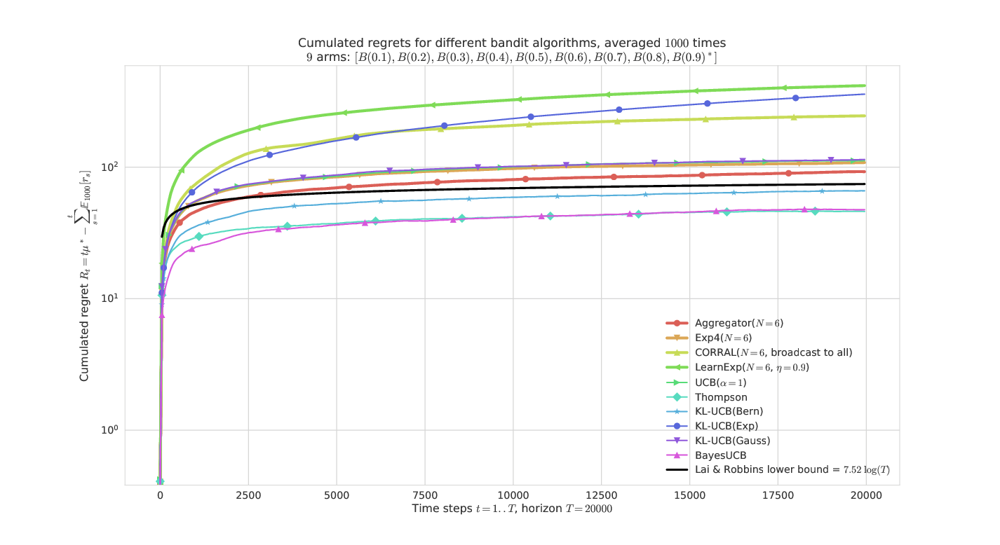
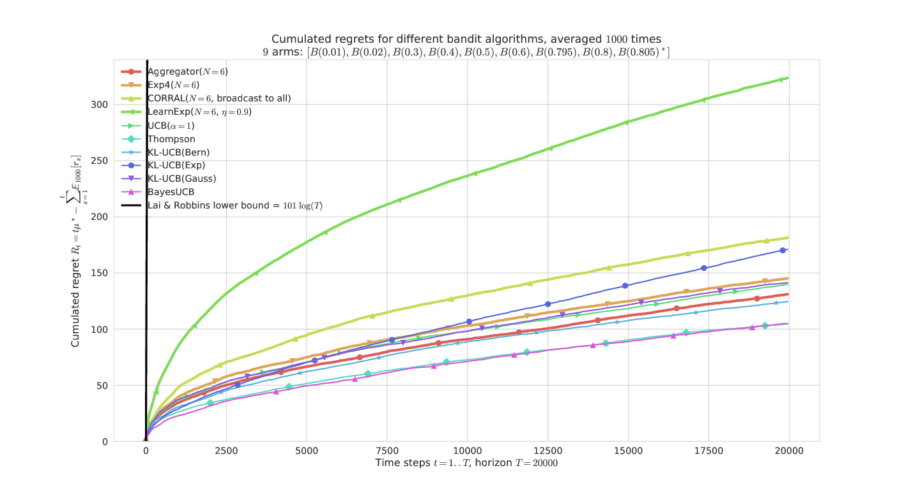
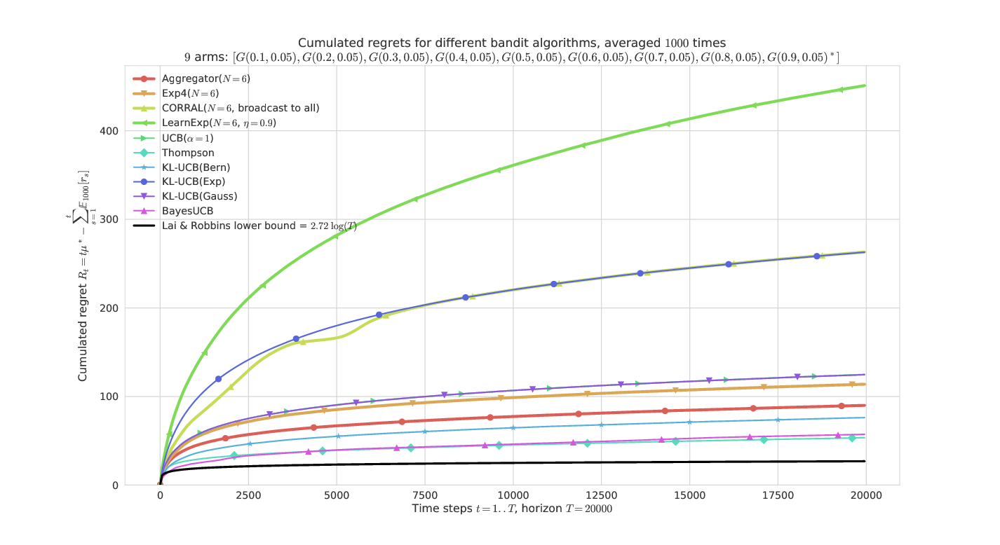
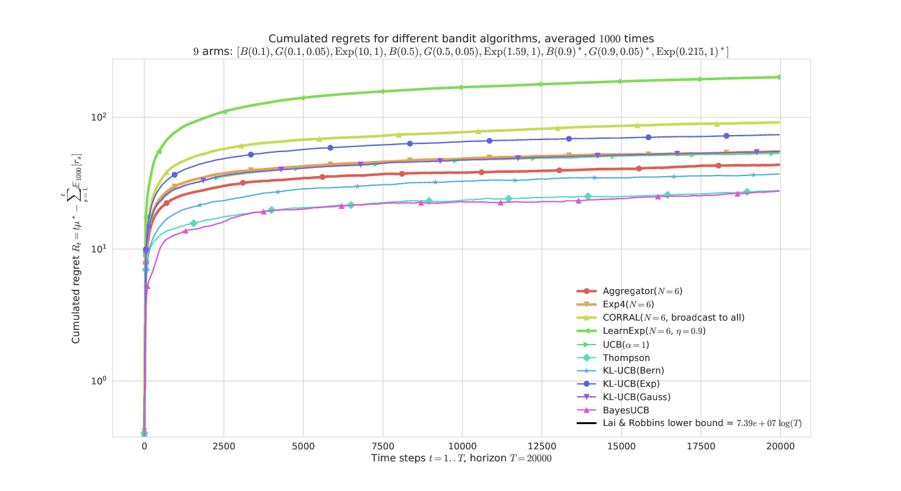
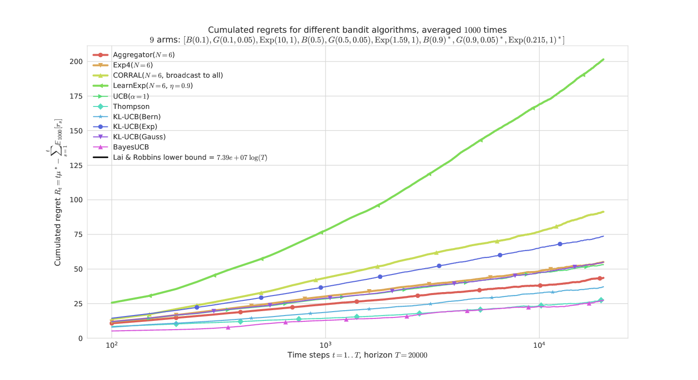

# **Policy aggregation algorithms**

- Remark: I wrote a small research article on that topic, it will be a better introduction as a small self-contained document to explain this idea and the algorithms. Reference: [[Aggregation of Multi-Armed Bandits Learning Algorithms for Opportunistic Spectrum Access, Lilian Besson and Emilie Kaufmann and Christophe Moy, 2017]](https://hal.inria.fr/hal-01705292), presented at the [IEEE WCNC 2018](http://wcnc2018.ieee-wcnc.org/) conference.

## Idea

The basic idea of a policy aggregation algorithm is to run in parallel some online learning algorithms, denoted `A_1`,...,`A_N` (`A_i`), and make them all vote at each step, and use some probabilistic scheme to select a decision from their votes.

Hopefully, if all the algorithms `A_i` are not too bad and at least one of them is efficient for the problem at hand, the aggregation algorithm will learn to mainly trust the efficient one(s) and discard the votes from the others.
An efficient aggregation algorithm should have performances similar to the best child algorithm `A_i`, in any problem.

The [Exp4 algorithm](http://sbubeck.com/SurveyBCB12.pdf) by [Auer et al, 2002] is the first aggregation algorithm for online bandit algorithms, and recently other algorithms include [LearnExp](Policies/LearnExp.py) ([[Singla et al, 2017](https://arxiv.org/abs/1702.04825)]) and [CORRAL](Policies/CORRAL.py) ([[Agarwal et al, 2017](https://arxiv.org/abs/1612.06246v2)]).

---

### Mathematical explanations
Initially, every child algorithms `A_i` has the same "trust" probability `p_i`, and at every step, the aggregated bandit first listen to the decision from all its children `A_i` (`a_{i,t}` in `1 .. K`), and then decide which arm to select by a probabilistic vote: the probability of selecting arm `k` is the sum of the trust probability of the children who voted for arm `k`.
It could also be done the other way: the aggregated bandit could first decide which children to listen to, then trust him.

But we want to update the trust probability of all the children algorithms, not only one, when it was wised to trust them.
Mathematically, when the aggregated arm choose to pull the arm `k` at step `t`, if it yielded a positive reward `r_{k,t}`, then the probability of all children algorithms `A_i` who decided (independently) to chose `k` (i.e., `a_{i,t} = k`) are increased multiplicatively: `p_i <- p_i * exp(+ beta * r_{k,t})` where `beta` is a positive *learning rate*, e.g., `beta = 0.1`.

It is also possible to decrease multiplicatively the trust of all the children algorithms who did not decided to chose the arm `k` at every step `t`: if `a_{i,t} != k` then `p_i <- p_i * exp(- beta * r_{k,t})`. I did not observe any difference of behavior between these two options (implemented with the Boolean parameter `updateAllChildren`).

### Ensemble voting for MAB algorithms
This algorithm can be seen as the Multi-Armed Bandits (i.e., sequential reinforcement learning) counterpart of an *ensemble voting* technique, as used for classifiers or regression algorithm in usual supervised machine learning (see, e.g., [`sklearn.ensemble.VotingClassifier`](http://scikit-learn.org/stable/modules/generated/sklearn.ensemble.VotingClassifier.html#sklearn.ensemble.VotingClassifier) in [scikit-learn](http://scikit-learn.org/)).

Another approach could be to do some sort of [grid search](http://scikit-learn.org/stable/modules/grid_search.html).

### My algorithm: [Aggregator](Policies/Aggregator.py)

It is based on a modification of Exp4, and the details are given in its documentation, see [Aggregator](Policies/Aggregator.py).

All the mathematical details can be found in my paper, [[Aggregation of Multi-Armed Bandits Learning Algorithms for Opportunistic Spectrum Access, Lilian Besson and Emilie Kaufmann and Christophe Moy, 2017]](https://hal.inria.fr/hal-01705292), presented at the [IEEE WCNC 2018](http://wcnc2018.ieee-wcnc.org/) conference.

----

## Configuration:
A simple python file, [`configuration_comparing_aggregation_algorithms.py`](configuration_comparing_aggregation_algorithms.py), is used to import the [arm classes](Arms/), the [policy classes](Policies/) and define the problems and the experiments.

For example, this will compare the classical MAB algorithms [`UCB`](Policies/UCB.py), [`Thompson`](Policies/Thompson.py), [`BayesUCB`](Policies/BayesUCB.py), [`klUCB`](Policies/klUCB.py) algorithms.

```python
configuration = {
    "horizon": 10000,    # Finite horizon of the simulation
    "repetitions": 100,  # number of repetitions
    "n_jobs": -1,        # Maximum number of cores for parallelization: use ALL your CPU
    "verbosity": 5,      # Verbosity for the joblib calls
    # Environment configuration, you can set up more than one.
    "environment": [
        {
            "arm_type": Bernoulli,  # Only Bernoulli is available as far as now
            "params": [0.01, 0.01, 0.01, 0.02, 0.02, 0.02, 0.05, 0.05, 0.05, 0.1]
        }
    ],
    # Policies that should be simulated, and their parameters.
    "policies": [
        {"archtype": UCB, "params": {} },
        {"archtype": Thompson, "params": {} },
        {"archtype": klUCB, "params": {} },
        {"archtype": BayesUCB, "params": {} },
    ]
}
```

To add an aggregated bandit algorithm ([`Aggregator` class](Policies/Aggregator.py)), you can use this piece of code, to aggregate all the algorithms defined before and dynamically add it to `configuration`:
```python
current_policies = configuration["policies"]
configuration["policies"] = current_policies +
    [{  # Add one Aggregator policy, from all the policies defined above
        "archtype": Aggregator,
        "params": {
            "learningRate": 0.05,  # Tweak this if needed
            "updateAllChildren": True,
            "children": current_policies,
        },
    }]
```

The learning rate can be tuned automatically, by using the heuristic proposed by [[Bubeck and Cesa-Bianchi](http://sbubeck.com/SurveyBCB12.pdf), Theorem 4.2], without knowledge of the horizon, a decreasing learning rate `\eta_t = sqrt(log(N) / (t * K))`.

----

## [How to run the experiments ?](How_to_run_the_code.md)

You should use the provided [`Makefile`](Makefile) file to do this simply:
```bash
make install  # install the requirements ONLY ONCE
make comparing_aggregation_algorithms   # run and log the main.py script
```

----

## Some illustrations
Here are some plots illustrating the performances of the different [policies](Policies/) implemented in this project, against various problems (with [`Bernoulli`](Arms/Bernoulli.py) arms only):

### On a "simple" Bernoulli problem (semi-log-y scale)


Aggregator is the most efficient, and very similar to Exp4 here.

### On a "harder" Bernoulli problem


They all have similar performances, except LearnExp, which performs badly.
We can check that the problem is indeed harder as the lower-bound (in black) is much larger.

### On an "easy" Gaussian problem


Only Aggregator shows reasonable performances, thanks to BayesUCB and Thompson sampling.
CORRAL and LearnExp clearly appears sub-efficient.

### On a harder problem, mixing Bernoulli, Gaussian, Exponential arms


This problem is much harder as it has 3 arms of each types with the *same mean*.



The semi-log-x scale clearly shows the logarithmic growth of the regret for the best algorithms and our proposal Aggregator, even in a hard "mixed" problem.

> These illustrations come from my article, [[Aggregation of Multi-Armed Bandits Learning Algorithms for Opportunistic Spectrum Access, Lilian Besson and Emilie Kaufmann and Christophe Moy, 2017]](https://hal.inria.fr/hal-01705292), presented at the [IEEE WCNC 2018](http://wcnc2018.ieee-wcnc.org/) conference.

----

## :scroll: License ? [](https://github.com/Naereen/AlgoBandits/blob/master/LICENSE)
[MIT Licensed](https://lbesson.mit-license.org/) (file [LICENSE](LICENSE)).

© 2016-2018 [Lilian Besson](https://GitHub.com/Naereen).

[](https://GitHub.com/Naereen/AlgoBandits/graphs/commit-activity)
[](https://GitHub.com/Naereen/ama)
[](https://GitHub.com/Naereen/AlgoBandits/)


[](http://ForTheBadge.com)
[](https://GitHub.com/)
