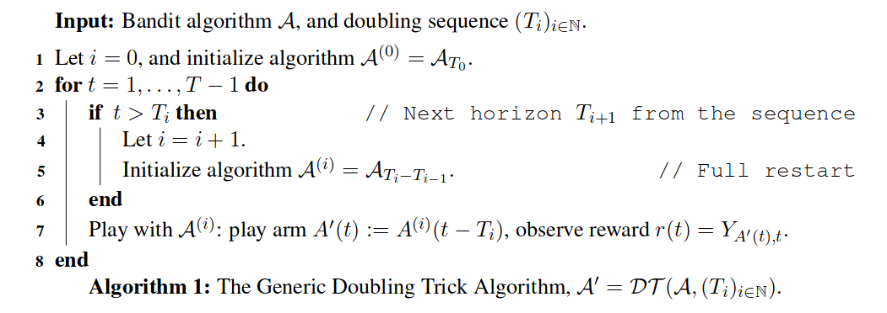
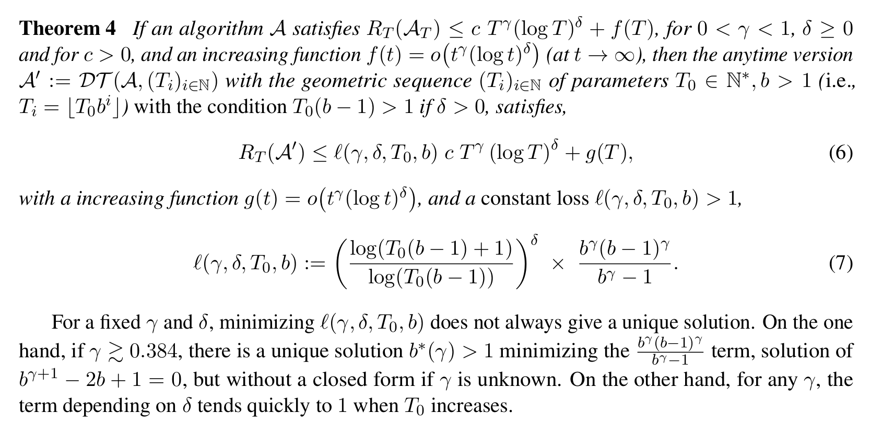
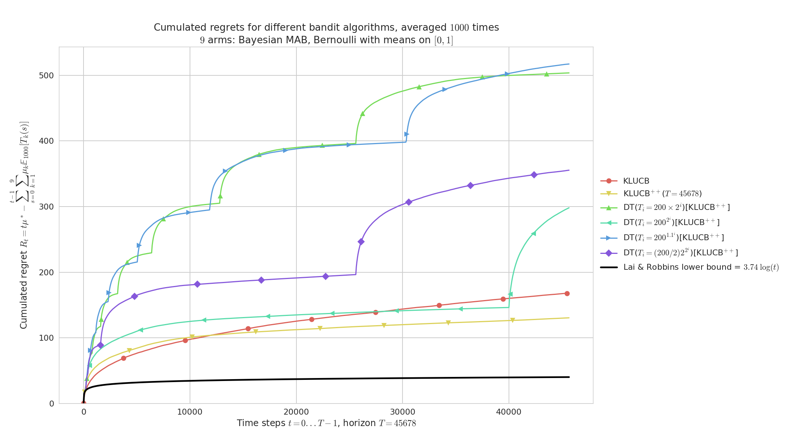
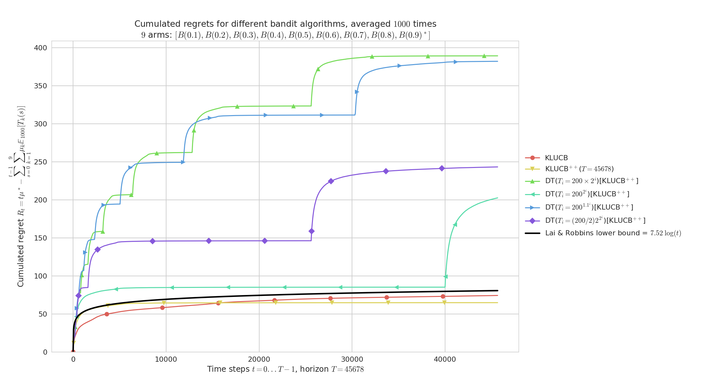
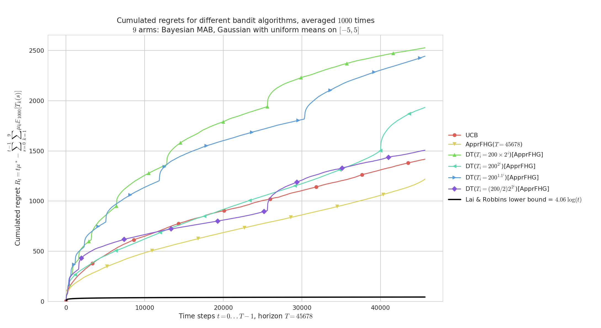
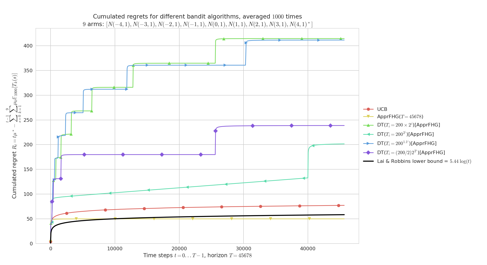
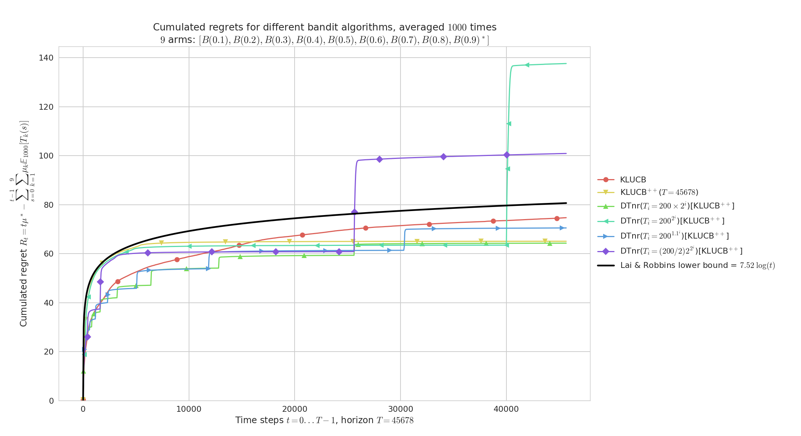

# **Doubling Trick for Multi-Armed Bandits**
I studied what [Doubling Trick](https://smpybandits.github.io/docs/Policies.DoublingTrickWrapper.html) can and can't do for multi-armed bandits, to obtain efficient anytime version of non-anytime optimal Multi-Armed Bandits algorithms.

The [Doubling Trick](https://smpybandits.github.io/docs/Policies.DoublingTrickWrapper.html) algorithm, denoted `$DT(A, (T_i))$` for a diverging increasing sequence `$T_i$`, is the following algorithm:



Long story short, we proved the two following theorems.

### For geometric sequences
> It works for minimax regret bounds (in `$R_T = \mathcal{O}(\sqrt{T}))$`, with a constant multiplicative loss `$\leq 4$`, but not for logarithmic regret bounds (in `$R_T = \mathcal{O}(\log T))$`.



### For exponential sequences
> It works for logarithmic regret bounds (in `$R_T = \mathcal{O}(\log T))$`, but not for minimax regret bounds (in `$R_T = \mathcal{O}(\sqrt{T}))$`.


----

## Article
I wrote a research article on that topic, it is a better introduction as a self-contained document to explain this idea and the algorithms. Reference: [[What the Doubling Trick Can or Can't Do for Multi-Armed Bandits, Lilian Besson and Emilie Kaufmann, 2018]](https://hal.inria.fr/hal-01736357).

> PDF : [BK__ALT_2018.pdf](https://hal.inria.fr/hal-01736357/document) | HAL notice : [BK__ALT_2018](https://hal.inria.fr/hal-01736357/) | BibTeX : [BK__ALT_2018.bib](https://hal.inria.fr/hal-01736357/bibtex) | [Source code and documentation](MultiPlayers.html)
> [](https://hal.inria.fr/hal-01736357) [](https://bitbucket.org/lbesson/what-doubling-tricks-can-and-cant-do-for-multi-armed-bandits/commits/) [](https://bitbucket.org/lbesson/ama)

----

## Configuration
A simple python file, [`configuration_comparing_doubling_algorithms.py`](https://smpybandits.github.io/docs/configuration_comparing_doubling_algorithms.html), is used to import the [arm classes](Arms/), the [policy classes](Policies/) and define the problems and the experiments.

For example, we can compare the standard anytime [`klUCB`](https://smpybandits.github.io/docs/Policies.klUCB.html) algorithm against the non-anytime [`klUCBPlusPlus`](https://smpybandits.github.io/docs/Policies.klUCBPlusPlus.html) algorithm, as well as 3 versions of [`DoublingTrickWrapper`](https://smpybandits.github.io/docs/Policies.DoublingTrickWrapper.html) applied to [`klUCBPlusPlus`](https://smpybandits.github.io/docs/Policies.klUCBPlusPlus.html).

```python
configuration = {
    "horizon": 10000,    # Finite horizon of the simulation
    "repetitions": 100,  # number of repetitions
    "n_jobs": -1,        # Maximum number of cores for parallelization: use ALL your CPU
    "verbosity": 5,      # Verbosity for the joblib calls
    # Environment configuration, you can set up more than one.
    "environment": [
        {
            "arm_type": Bernoulli,
            "params": 0.1, 0.2, 0.3, 0.4, 0.5, 0.6, 0.7, 0.8, 0.9
        }
    ],
    # Policies that should be simulated, and their parameters.
    "policies": [
        {"archtype": UCB, "params": {} },
        {"archtype": klUCB, "params": {} },
        {"archtype": klUCBPlusPlus, "params": { "horizon": 10000 } },
    ]
}
```

Then add a [Doubling-Trick](https://smpybandits.github.io/docs/Policies.DoublingTrickWrapper.html) bandit algorithm ([`DoublingTrickWrapper` class](https://smpybandits.github.io/docs/Policies.DoublingTrickWrapper.html)), you can use this piece of code:

```python
configuration["policies"] += [
    {
        "archtype": DoublingTrickWrapper,
        "params": {
            "next_horizon": next_horizon,
            "full_restart": full_restart,
            "policy": BayesUCB,
        }
    }
    for full_restart in [ True, False ]
    for next_horizon in [
        next_horizon__arithmetic,
        next_horizon__geometric,
        next_horizon__exponential_fast,
        next_horizon__exponential_slow,
        next_horizon__exponential_generic
    ]
]
```

----

## [How to run the experiments ?](How_to_run_the_code.md)

You should use the provided [`Makefile`](Makefile) file to do this simply:
```bash
# if not already installed, otherwise update with 'git pull'
git clone https://github.com/SMPyBandits/SMPyBandits/
cd SMPyBandits
make install  # install the requirements ONLY ONCE
make comparing_doubling_algorithms   # run and log the main.py script
```

----

## Some illustrations
Here are some plots illustrating the performances of the different [policies](https://smpybandits.github.io/docs/Policies/) implemented in this project, against various problems (with [`Bernoulli`](https://smpybandits.github.io/docs/Arms.Bernoulli.html) and [`UnboundedGaussian`](https://smpybandits.github.io/docs/Arms.Gaussian.html) arms only):

### [Doubling-Trick](https://smpybandits.github.io/docs/Policies.DoublingTrickWrapper.html) with restart, on a "simple" Bernoulli problem


Regret for [Doubling-Trick](https://smpybandits.github.io/docs/Policies.DoublingTrickWrapper.html), for `$K=9$` [Bernoulli arms](https://smpybandits.github.io/docs/Arms.Bernoulli.html), horizon `$T=45678$`, `$n=1000$` repetitions and `$\mu_1,\ldots,\mu_K$` taken uniformly in `$[0,1]^K$`.
Geometric doubling (`$b=2$`) and slow exponential doubling (`$b=1.1$`) are too slow, and short first sequences make the regret blow up in the beginning of the experiment.
At `$t=40000$` we see clearly the effect of a new sequence for the best [doubling trick](https://smpybandits.github.io/docs/Policies.DoublingTrickWrapper.html) (`$T_i = 200 \times 2^i$`).
As expected, [kl-UCB++](https://smpybandits.github.io/docs/Policies.klUCBPlusPlus.html) outperforms [kl-UCB](https://smpybandits.github.io/docs/Policies.klUCB.html), and if the doubling sequence is growing fast enough then [Doubling-Trick](https://smpybandits.github.io/docs/Policies.DoublingTrickWrapper.html)([kl-UCB++](https://smpybandits.github.io/docs/Policies.klUCBPlusPlus.html)) can perform as well as [kl-UCB++](https://smpybandits.github.io/docs/Policies.klUCBPlusPlus.html) (see for `$t < 40000$`).

### [Doubling-Trick](https://smpybandits.github.io/docs/Policies.DoublingTrickWrapper.html) with restart, on randomly taken Bernoulli problems


Similarly but for `$\mu_1,\ldots,\mu_K$` evenly spaced in `$[0,1]^K$` (`${0.1,\ldots,0.9}$`).
Both [kl-UCB](https://smpybandits.github.io/docs/Policies.klUCB.html) and [kl-UCB++](https://smpybandits.github.io/docs/Policies.klUCBPlusPlus.html) are very efficient on "easy" problems like this one, and we can check visually that they match the lower bound from Lai & Robbins (1985).
As before we check that slow doubling are too slow to give reasonable performance.


### [Doubling-Trick](https://smpybandits.github.io/docs/Policies.DoublingTrickWrapper.html) with restart, on randomly taken Gaussian problems with variance `$V=1$`


Regret for `$K=9$` [Gaussian arms](https://smpybandits.github.io/docs/Arms.Gaussian.html) `$\mathcal{N}(\mu, 1)$`, horizon `$T=45678$`, `$n=1000$` repetitions and `$\mu_1,\ldots,\mu_K$` taken uniformly in `$[-5,5]^K$` and variance `$V=1$`.
On "hard" problems like this one, both [UCB](https://smpybandits.github.io/docs/Policies.UCB.html) and [AFHG](https://smpybandits.github.io/docs/Policies.ApproximatedFHGittins.html) perform similarly and poorly w.r.t. to the lower bound from Lai & Robbins (1985).
As before we check that geometric doubling (`$b=2$`) and slow exponential doubling (`$b=1.1$`) are too slow, but a fast enough doubling sequence does give reasonable performance for the anytime [AFHG](https://smpybandits.github.io/docs/Policies.ApproximatedFHGittins.html) obtained by [Doubling-Trick](https://smpybandits.github.io/docs/Policies.DoublingTrickWrapper.html).

### [Doubling-Trick](https://smpybandits.github.io/docs/Policies.DoublingTrickWrapper.html) with restart, on an easy Gaussian problems with variance `$V=1$`


Regret for [Doubling-Trick](https://smpybandits.github.io/docs/Policies.DoublingTrickWrapper.html), for `$K=9$` [Gaussian arms](https://smpybandits.github.io/docs/Arms.Gaussian.html) `$\mathcal{N}(\mu, 1)$`, horizon `$T=45678$`, `$n=1000$` repetitions and `$\mu_1,\ldots,\mu_K$` uniformly spaced in `$[-5,5]^K$`.
On "easy" problems like this one, both [UCB](https://smpybandits.github.io/docs/Policies.UCB.html) and [AFHG](https://smpybandits.github.io/docs/Policies.ApproximatedFHGittins.html) perform similarly and attain near constant regret (identifying the best [Gaussian arm](https://smpybandits.github.io/docs/Arms.Gaussian.html) is very easy here as they are sufficiently distinct).
Each [doubling trick](https://smpybandits.github.io/docs/Policies.DoublingTrickWrapper.html) also appear to attain near constant regret, but geometric doubling (`$b=2$`) and slow exponential doubling (`$b=1.1$`) are slower to converge and thus less efficient.


### [Doubling-Trick](https://smpybandits.github.io/docs/Policies.DoublingTrickWrapper.html) with no restart, on randomly taken Bernoulli problems


Regret for `$K=9$` [Bernoulli arms](https://smpybandits.github.io/docs/Arms.Bernoulli.html), horizon `$T=45678$`, `$n=1000$` repetitions and `$\mu_1,\ldots,\mu_K$` taken uniformly in `$[0,1]^K$`, for [Doubling-Trick](https://smpybandits.github.io/docs/Policies.DoublingTrickWrapper.html) no-restart.
Geometric doubling (\eg, `$b=2$`) and slow exponential doubling (\eg, `$b=1.1$`) are too slow, and short first sequences make the regret blow up in the beginning of the experiment.
At `$t=40000$` we see clearly the effect of a new sequence for the best [doubling trick](https://smpybandits.github.io/docs/Policies.DoublingTrickWrapper.html) (`$T_i = 200 \times 2^i$`).
As expected, [kl-UCB++](https://smpybandits.github.io/docs/Policies.klUCBPlusPlus.html) outperforms [kl-UCB](https://smpybandits.github.io/docs/Policies.klUCB.html), and if the doubling sequence is growing fast enough then [Doubling-Trick](https://smpybandits.github.io/docs/Policies.DoublingTrickWrapper.html) no-restart for [kl-UCB++](https://smpybandits.github.io/docs/Policies.klUCBPlusPlus.html) can perform as well as [kl-UCB++](https://smpybandits.github.io/docs/Policies.klUCBPlusPlus.html).

### [Doubling-Trick](https://smpybandits.github.io/docs/Policies.DoublingTrickWrapper.html) with no restart, on an "simple" Bernoulli problems


`$K=9$` [Bernoulli arms](https://smpybandits.github.io/docs/Arms.Bernoulli.html) with `$\mu_1,\ldots,\mu_K$` evenly spaced in `$[0,1]^K$`.
On easy problems like this one, both [kl-UCB](https://smpybandits.github.io/docs/Policies.klUCB.html) and [kl-UCB++](https://smpybandits.github.io/docs/Policies.klUCBPlusPlus.html) are very efficient, and here the geometric allows the [Doubling-Trick](https://smpybandits.github.io/docs/Policies.DoublingTrickWrapper.html) no-restart anytime version of [kl-UCB++](https://smpybandits.github.io/docs/Policies.klUCBPlusPlus.html) to outperform both [kl-UCB](https://smpybandits.github.io/docs/Policies.klUCB.html) and [kl-UCB++](https://smpybandits.github.io/docs/Policies.klUCBPlusPlus.html).


> These illustrations come from my article, [[What the Doubling Trick Can or Can't Do for Multi-Armed Bandits, Lilian Besson and Emilie Kaufmann, 2018]](https://hal.inria.fr/hal-01736357).


----

### :scroll: License ? [](https://github.com/SMPyBandits/SMPyBandits/blob/master/LICENSE)
[MIT Licensed](https://lbesson.mit-license.org/) (file [LICENSE](LICENSE)).

© 2016-2018 [Lilian Besson](https://GitHub.com/Naereen).

[](https://github.com/SMPyBandits/SMPyBandits/)
[](https://GitHub.com/SMPyBandits/SMPyBandits/graphs/commit-activity)
[](https://GitHub.com/Naereen/ama)
[](https://GitHub.com/SMPyBandits/SMPyBandits/)
](https://pypi.org/project/SMPyBandits)
](https://pypi.org/project/SMPyBandits)
[](https://pypi.org/project/SMPyBandits)](https://pypi.org/project/SMPyBandits)
[](https://pypi.org/project/SMPyBandits)](https://pypi.org/project/SMPyBandits)
[](https://pypi.org/project/SMPyBandits)](https://pypi.org/project/SMPyBandits)
[](https://SMPyBandits.ReadTheDocs.io/en/latest/?badge=latest)
[](https://travis-ci.org/SMPyBandits/SMPyBandits)
[](https://GitHub.com/SMPyBandits/SMPyBandits/stargazers)
[](https://github.com/SMPyBandits/SMPyBandits/releases)
