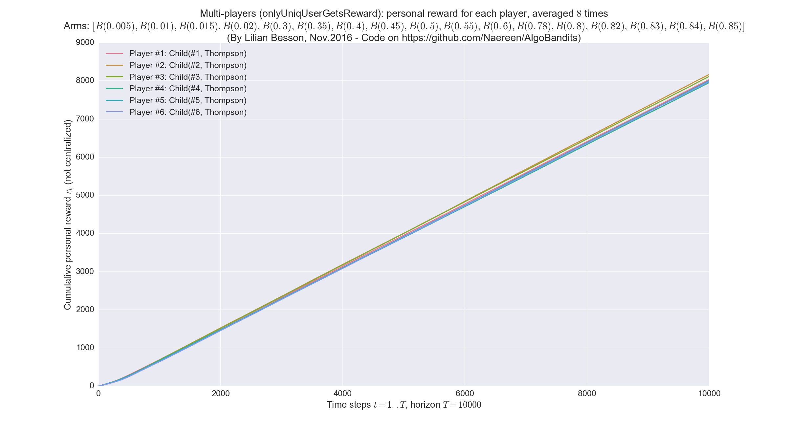
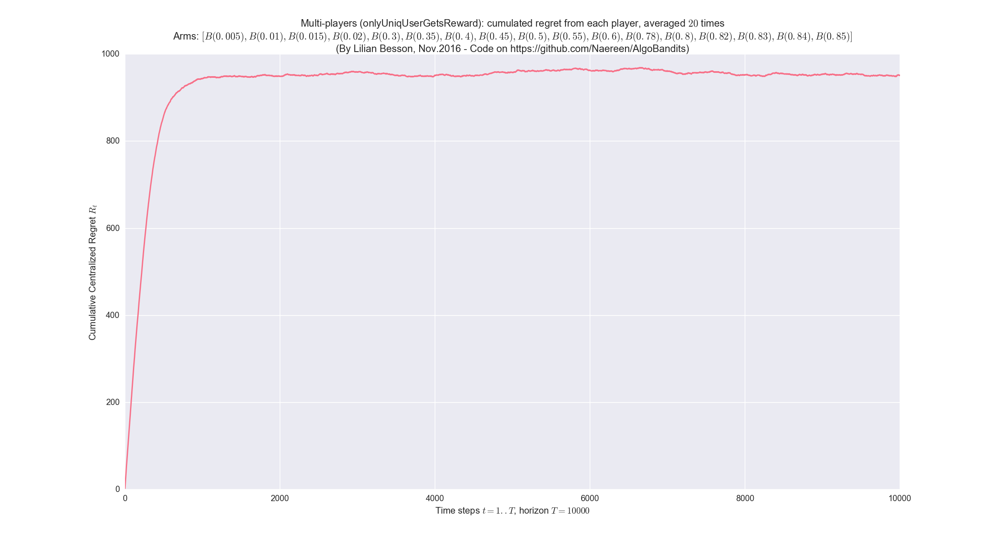
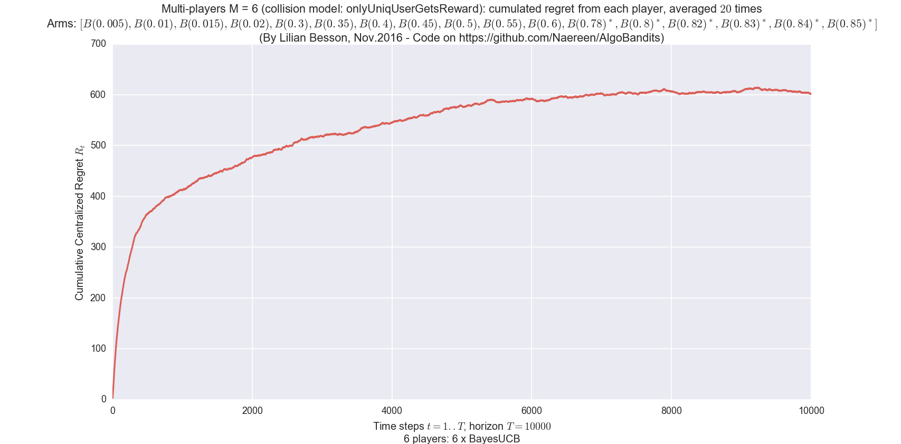
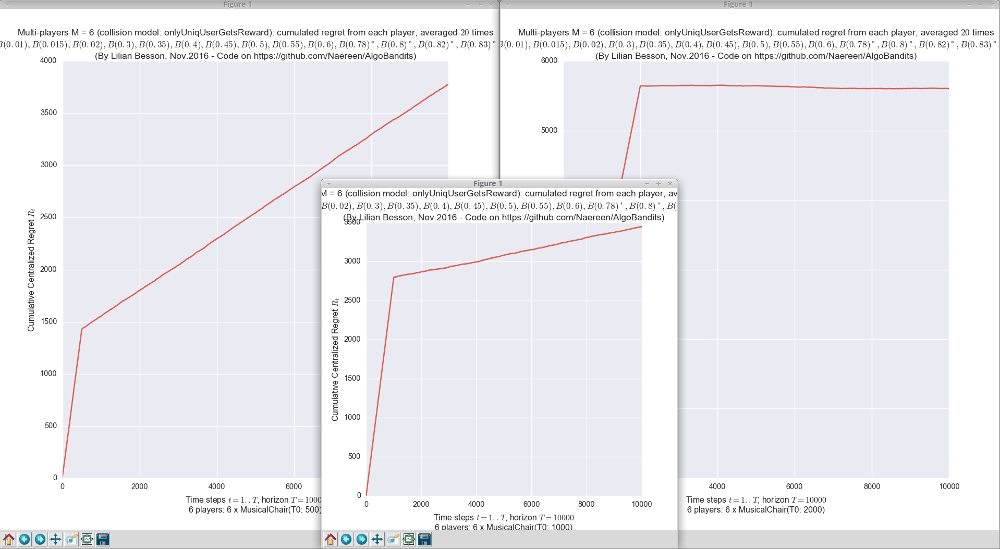
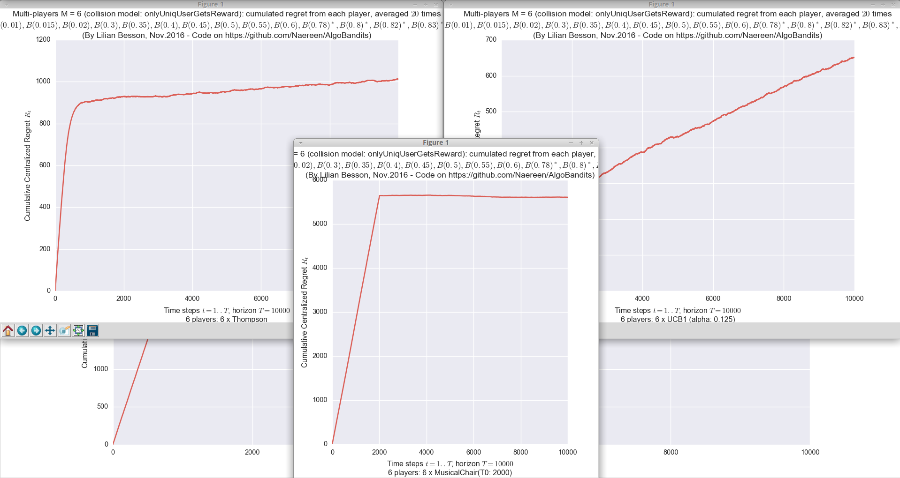

## 2nd contribution: [**Multi-players simulation environment**](MultiPlayers.md)
> I have started the multi-player part, it will take time to be finished.

There is another point of view: instead of comparing different single-player policies on the same problem, we can make them play against each other, in a multi-player setting.
The basic difference is about **collisions** : at each time `t`, if two or more user chose to sense the same channel, there is a *collision*. Collisions can be handled in different way from the base station point of view, and from each player point of view.

### Collision models
For example, I implemented these different collision models, in [`CollisionModels.py`](Environment/CollisionModels.py):

 - `noCollision` is a limited model *where* all players can sample an arm with collision. It corresponds to the single-player simulation: each player is a policy, compared without collision. This is for testing only, not so interesting.
 - `onlyUniqUserGetsReward` is a simple collision model where only the players alone on one arm sample it and receive the reward. This is the default collision model in the literature, for instance cf. [[Shamir et al., 2015]](https://arxiv.org/abs/0910.2065v3) collision model 1 or cf [[Liu & Zhao, 2009]](https://arxiv.org/abs/0910.2065v3).
 - `rewardIsSharedUniformly` is similar: the players alone on one arm sample it and receive the reward, and in case of more than one player on one arm, only one player (uniform choice, chosen by the base station) can sample it and receive the reward.
 - `closerUserGetsReward` is similar but uses another approach to chose who can emit. Instead of randomly choosing the lucky player, it uses a given (or random) vector indicating the *distance* of each player to the base station (it can also indicate the quality of the communication), and when two (or more) players are colliding, only the one who is closer to the base station can transmit. It is the more physically plausible.

----

### More details on the code
Have a look to:
- [`main_multiplayers.py`](./main_multiplayers.py) and [`configuration_multiplayers.py`](./configuration_multiplayers.py) to run and configure the simulation,
- the [`EvaluatorMultiPlayers`](./Environment/EvaluatorMultiPlayers.py) class that performs the simulation,
- the [`ResultMultiPlayers`](./Environment/ResultMultiPlayers.py) class to store the results,
- and some naive policies are implemented in the [`PoliciesMultiPlayers/`](./PoliciesMultiPlayers/) folder. As far as now, there is the [`Selfish`](PoliciesMultiPlayers/Selfish.py), [`CentralizedFixed`](PoliciesMultiPlayers/CentralizedFixed.py), [`CentralizedCycling`](PoliciesMultiPlayers/CentralizedCycling.py), [`OracleNotFair`](PoliciesMultiPlayers/OracleNotFair.py), [`OracleFair`](PoliciesMultiPlayers/OracleFair.py) multi-players policy.

### Policies designed to be used in the multi-players setting
- The first one I implemented is the ["Musical Chair"](https://arxiv.org/abs/1512.02866) policy, from [[Shamir et al., 2015]](https://arxiv.org/abs/0910.2065v3), in [`MusicalChair`](Policies/MusicalChair.py).
- Then I implemented the ["MEGA"](https://arxiv.org/abs/1404.5421) policy from [[Avner & Mannor, 2014]](https://arxiv.org/abs/1404.5421), in [`MEGA`](Policies/MEGA.py). But it has too much parameter, the question is how to chose them?

----

## Configuration:
A simple python file, [`configuration.py`](configuration.py), is used to import the [arm classes](Arms/), the [policy classes](Policies/) and define the problems and the experiments.
See the explanations given for [the simple-player case](Aggr.md).

```python
nbArms = len(configuration['environment'][0]['params'])
# WARNING do not use this hack if you try to use more than one environment
configuration.update({
    # Uncomment the lines you don't want, keep ONLY one line
    # --- Using multi-player Selfish policy
    "players": Selfish(NB_PLAYERS, Uniform, nbArms).children   # Stupid one
    "players": Selfish(NB_PLAYERS, TakeRandomFixedArm, nbArms).children  # Also stupid one
    "players": Selfish(NB_PLAYERS, Softmax, nbArms, temperature=TEMPERATURE).children  # Based on empirical means
    "players": Selfish(NB_PLAYERS, UCBalpha, nbArms, alpha=1./4).children  # This one is efficient!
    # --- Using multi-player Centralized policy, un-fair or fair
    "players": CentralizedFixed(NB_PLAYERS, nbArms).children
    "players": CentralizedCycling(NB_PLAYERS, nbArms).children
    # --- Using multi-player Oracle policy, un-fair or fair
    # Note: they need a perfect knowledge on the arms, even this is not physically plausible
    "players": OracleNotFair(NB_PLAYERS, MAB(configuration['environment'][0])).children
    "players": OracleFair(NB_PLAYERS, MAB(configuration['environment'][0])).children
    # --- Using single-player Musical Chair policy
    "players": Selfish(NB_PLAYERS, MusicalChair, nbArms, Time0=0.1, Time1=HORIZON).children
})
```

- The multi-players policies are added by giving a list of their children (`CentralizedCycling(*args).children`), who are instances of the proxy class [`ChildPointer`](PoliciesMultiPlayers/ChildPointer.py). Each child methods is just passed back to the mother class (the multi-players policy, e.g., `CentralizedCycling`), who can then handle the calls as it wants (can be centralized or not).
- *I know*, it's not perfectly clear yet and not simple to use. Just read the code. I will improve the documentation!

----

### Some illustrations of multi-players simulations
Here are one example of simulation: `M = 6` players independently and selfishly play according to the [`Thompson`](Policies/Thompson.py) policy, against `K = 17` unknown Bernoulli arms, in a [collision model where only the player alone on an arm can sample it and gets some reward](Environment/CollisionModels.py).

- First, their own personal *rewards* along the time, showing that all the `M = 6` players achieve similar average reward, about `0.82 × Horizon`. This is a satisfactory result, as the average availability of the best `M` channels is exactly `0.82`: it means that, in average in these 20 simulations, every player achieves a linear reward with the good slope, indicating that they all select their arms among the best `M` channels.
[](plots/10000_steps__6_Thompson_on_Selfish_multi-players.png)

- Then, the centralized regret, which in this case seems to be converging to a constant (or growing very slowly). That is a very good performance: the regret almost stops growing after some 700 steps or so:
[](plots/10000_steps__20_repetitions_6_Thompson_on_Selfish_multi-players__centralized_regret.png)
- The same is obtained for other order-optimal single-player policies (eg. KL-UCB, BayesUCB, UCB1 with good choice of alpha etc), in a purely selfish setting where every `M` player runs locally, without knowing the number of players and the collision model, they are able to learn and find an orthogonal affectation among the best `M` channels:
[](plots/10000_steps__20_repetitions_6_BayesUCB_on_Selfish_multi-players__centralized_regret.png)

- Of course, this is not perfect, as the limit value of the regret is quite high, when compared to an ideal setting with communication and full knowledge of the arm ([`OracleFair`](PoliciesMultiPlayers/OracleFair.py), the best possible policy):
[](plots/10000_steps__20_repetitions_6_OracleFair_on_Oracle_multi-players__centralized_regret.png)

### Comparison of different multi-players policies
- It compared a [`Selfish`](PoliciesMultiPlayers/Selfish.py) policy, where each players runs a UCBalpha or Thompson algorithm, against a [`MusicalChair`](Policies/MusicalChair.py) policy.

[](plots/10000_steps__20_repetitions_6_MusicalChair_on_Selfish_multi-players__centralized_regret_comparison.png)
[](plots/10000_steps__20_repetitions_6_MusicalChair_on_Selfish_multi-players__centralized_regret_comparison2.png)

----

## Fairness vs. unfairness
For a multi-player policy, being fair means that on *every* simulation with `M` players, each player access any of the `M` best arms (about) the same amount of time.
It is important to highlight that it has to be verified on each run of the MP policy, having this property in average is NOT enough.

- For instance, the oracle policy [`OracleNotFair`](PoliciesMultiPlayers/OracleNotFair.py) affects each of the `M` players to one of the `M` best arms, orthogonally, but once they are affected they always pull this arm. It's unfair because one player will be lucky and affected to the best arm, the others are unlucky. The centralized regret is optimal (null, in average), but it is not fair.
- And the other oracle policy [`OracleFair`](PoliciesMultiPlayers/OracleFair.py) affects an offset to each of the `M` players corresponding to one of the `M` best arms, orthogonally, and once they are affected they will cycle among the best `M` arms. It's fair because every player will pull the `M` best arms an equal number of time. And the centralized regret is also optimal (null, in average).

- Usually, the [`Selfish`](PoliciesMultiPlayers/Selfish.py) policy is *not* fair: as each player is selfish and tries to maximize her personal regret, there is no reason for them to share the time on the `M` best arms.

- Conversely, the [`MusicalChair`](Policies/MusicalChair.py) policy is *not* fair either, and cannot be: when each player has attained the last step, ie. they are all choosing the same arm, orthogonally, and they are not sharing the `M` best arms.

- The [`MEGA`](Policies/MEGA.py) policy is designed to be fair: when players collide, they all have the same chance of leaving or staying on the arm, and they all sample from the `M` best arms equally.

- The [`rhoRand`](PoliciesMultiPlayers/rhoRand.py) policy is not designed to be fair: when players collide, they all take a random rank from the same distribution `rank_k ~ Uniform(U)`. Note that it can be fair, but not with high probability.

----

## How to run the experiments ?
*First*, install the requirements:
```bash
pip install -r requirements.txt
```

*Then*, it should be very straight forward to run some experiment.
This will run the simulation, average them (by `repetitions`) and plot the results:
```bash
python main_multiplayers.py
```

### Or with a [`Makefile`](Makefile) ?
You can also use the provided [`Makefile`](Makefile) file to do this simply:
```bash
make install       # install the requirements
make multiplayers  # run and log the main.py script
```

It can be used to check [the quality of the code](logs/main_pylint_log.txt) with [pylint](https://www.pylint.org/):
```bash
make lint lint3  # check the code with pylint
```

----

## Code organization
### Layout of the code:
- Arms are defined in [this folder (`Arms/`)](Arms/), see for example [`Arms.Bernoulli`](Arms/Bernoulli.py)
- [`main_multiplayers.py`](./main_multiplayers.py) and [`configuration_multiplayers.py`](./configuration_multiplayers.py) to run and configure the simulation,
- the [`EvaluatorMultiPlayers`](./Environment/EvaluatorMultiPlayers.py) class that performs the simulation,
- the [`ResultMultiPlayers`](./Environment/ResultMultiPlayers.py) class to store the results,
- and some naive policies are implemented in the [`PoliciesMultiPlayers/`](./PoliciesMultiPlayers/) folder. As far as now, there is the [`Selfish`](PoliciesMultiPlayers/Selfish.py), [`CentralizedFixed`](PoliciesMultiPlayers/CentralizedFixed.py), [`CentralizedCycling`](PoliciesMultiPlayers/CentralizedCycling.py), [`OracleNotFair`](PoliciesMultiPlayers/OracleNotFair.py), [`OracleFair`](PoliciesMultiPlayers/OracleFair.py) multi-players policy.

### UML diagrams
For more details, see [these UML diagrams](uml_diagrams/):

- Packages: organization of the different files:
  [](uml_diagrams/packages_AlgoBandits.svg)
- Classes: inheritance diagrams of the different classes:
  [](uml_diagrams/classes_AlgoBandits.svg)

----

## :scroll: License ? [](https://github.com/Naereen/AlgoBandits/blob/master/LICENSE)
[MIT Licensed](https://lbesson.mit-license.org/) (file [LICENSE](LICENSE)).

© 2012 [Olivier Cappé](http://perso.telecom-paristech.fr/%7Ecappe/), [Aurélien Garivier](https://www.math.univ-toulouse.fr/%7Eagarivie/), [Émilie Kaufmann](http://chercheurs.lille.inria.fr/ekaufman/) and for the initial [pymaBandits v1.0](http://mloss.org/software/view/415/) project, and © 2016-2017 [Lilian Besson](https://GitHub.com/Naereen) for the rest.

[](https://GitHub.com/Naereen/AlgoBandits/graphs/commit-activity)
[](https://GitHub.com/Naereen/ama)
[](https://GitHub.com/Naereen/AlgoBandits/)


[](http://ForTheBadge.com)
[](https://GitHub.com/)
