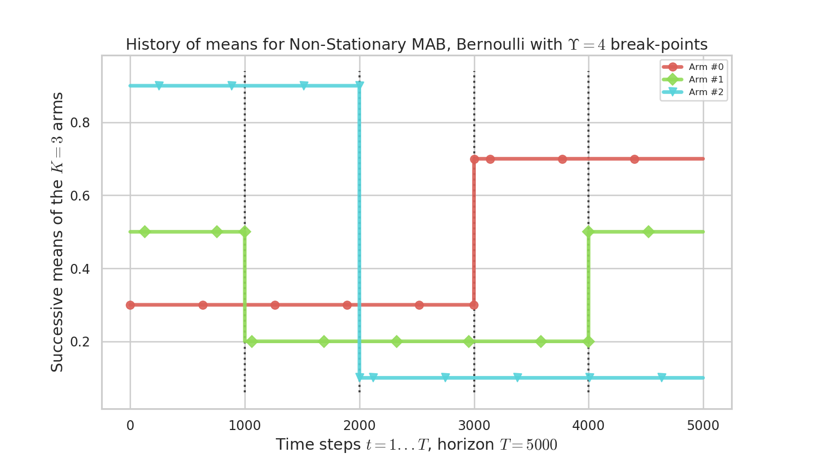
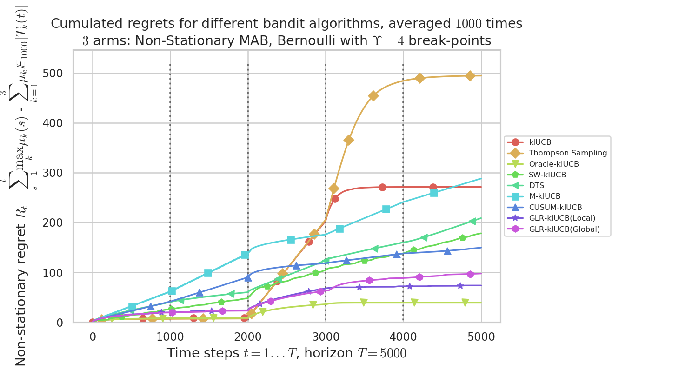
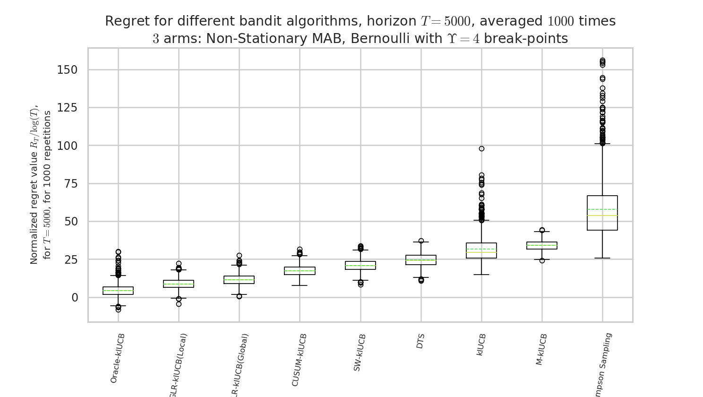
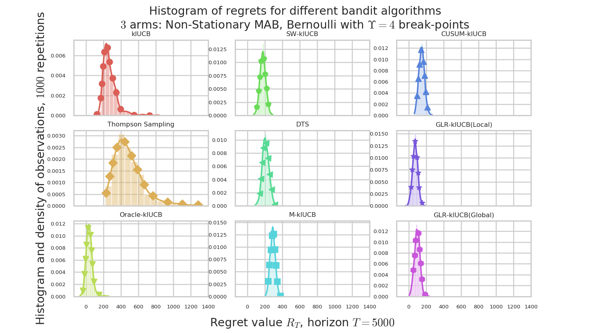
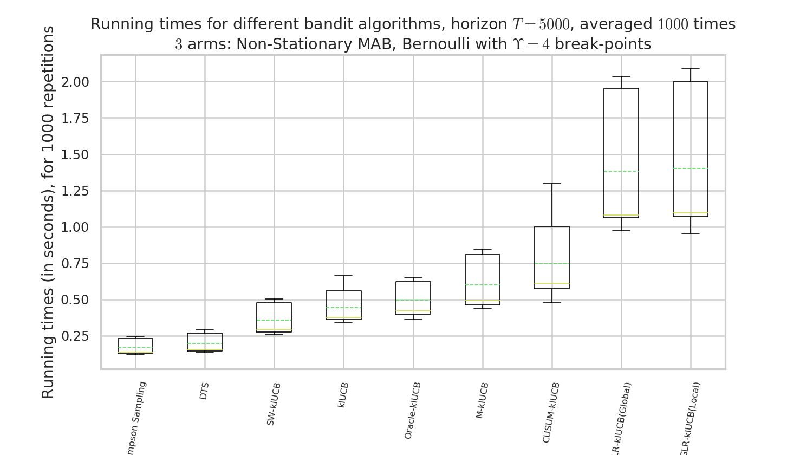
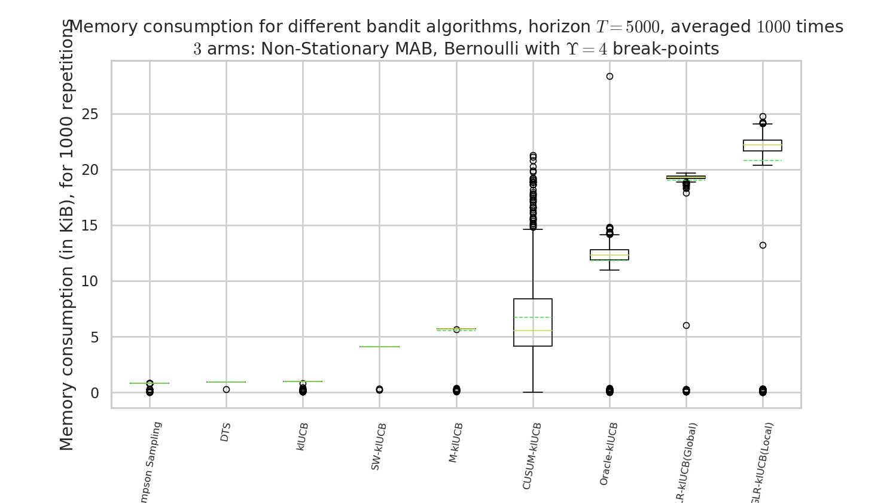

# **Non-Stationary Stochastic Multi-Armed Bandits**

A well-known and well-studied variant of the [stochastic Multi-Armed Bandits](https://en.wikipedia.org/wiki/Multi-armed_bandit) is the so-called **Non-Stationary Stochastic Multi-Armed Bandits**.
I give here a short introduction, with references below. If you are in a hurry, please read the first two pages of [this recent article instead (arXiv:1802.08380)](https://arxiv.org/pdf/1802.08380).

- The first studied variant considers *piece-wise* stationary problems, also referred to as **abruptly changing**, where the distributions of the `$K$` arms are stationary on some intervals `$[T_i,\ldots,T_{i+1}]$` with some abrupt change points `$(T_i)$`.
    + It is always assumed that the location of the change points are unknown to the user, otherwise the problem is not harder: just play your [favorite algorithm](docs/Policies.html), and restart it at each change point.
    + The change points can be fixed or randomly generated, but it is assumed that they are generated with a random source being oblivious of the user's actions, so we can always consider that they were already generated before the game starts.
    + For instance, [`Arms.geometricChangePoints()`](docs/Arms.html#Arms.geometricChangePoints) generates some change point if we assume that at every time step `$t=1,\ldots,T]$`, there is a (small) probability p to have a change point.
    + The number of change points is usually denoted `$L$` or `$\Upsilon_T$`, and should not be a constant w.r.t. `$T$` (otherwise when `$T\to\infty$` only the last section counts and give a stationary problem so it is not harder). Some algorithms require to know the value of `$\Upsilon_T$`, or at least an upper-bound, and some algorithms try to be efficient without knowing it (this is what we want!).
    + The goal is to have an efficient algorithm, but of course if `$\Upsilon_T = \mathcal{O}(T)$` the problem is too hard to hope to be efficient and any algorithm will suffer a linear regret (i.e., be as efficient as a naive random strategy).

- Another variant is the **slowly varying** problem, where the rewards `$r(t) = r_{A(t),t}$` is sampled at each time from a parametric distribution, and the parameter(s) change at each time (usually parametrized by its mean). If we focus on 1D exponential families, or any family of distributions parametrized by their mean `$\mu$`, we denote this by having `$r(t) \sim D(\mu_{A(t)}(t))$` where `$\mu_k(t)$` can be varying with the time. The slowly varying hypothesis is that every time step can be a break point, and that the speed of change `$|\mu_k(t+1) - \mu_k(t)|$` is bounded.

- Other variants include harder settings.
    + For instance, we can consider that an adversarial is deciding the change points, by being adaptative to the user's actions. I consider it harder, as always with adversarial problems, and not very useful to model real-world problems.
    + Another harder setting is a "pseudo-Markovian rested" point-of-view: the mean (or parameters) of an arm's distribution can change only when it is sampled, either from time to time or at each time step. It makes sense for some applications, for instance [Julien's work (in SequeL Inria team)](https://www.linkedin.com/in/julien-seznec-29364a104/), but for others it doesn't really make sense (e.g., cognitive radio applications).

TODO fix notations more precisely, include definitions!
TODO what are the lower-bounds given in the more recent articles?

## Applications

*TL;DR*: the world is non stationary, so it makes sense to study this!

TODO write more justifications about applications, mainly for IoT networks (like when I studied [multi-player bandits](MultiPlayers)).

## References

Here is a partial list of references on this topic. For more, a good starting point is to read the references given in the mentioned article, as always.

### Main references

1. It is not on non-stationary but on non-stochastic (i.e., adversary) bandits, but it can be a good reading for the curious reader. [["The Non-Stochastic Multi-Armed Bandit Problem". P. Auer, N. Cesa-Bianchi, Y. Freund and R. Schapire. SIAM journal on computing, 32(1), 48-77, 2002](https://epubs.siam.org/doi/pdf/10.1137/S0097539701398375)].

2. The Sliding-Window and Discounted UCB algorithms were given in [["On Upper-Confidence Bound Policies for Non-Stationary Bandit Problems". Aurélien Garivier and Éric Moulines, ALT 2011](https://arxiv.org/pdf/0805.3415.pdf)].
    + They are implemented in [`Policies.SlidingWindowUCB.SWUCB`](docs/Policies.SlidingWindowUCB.html#Policies.SlidingWindowUCB.SWUCB) and [`Policies.DiscountedUCB`](docs/Policies.DiscountedUCB.html).
    + Note that I also implemented the non-anytime heuristic given by the author, [`Policies.SlidingWindowUCB.SWUCBPlus`](docs/Policies.SlidingWindowUCB.html#Policies.SlidingWindowUCB.SWUCBPlus) which uses the knowledge of the horizon `$T$` to *try to* guess a correct value for `$\tau$` the sliding window size.
    + I implemented this sliding window idea in a generic way, and [`Policies.SlidingWindowRestart`](docs/Policies.SlidingWindowRestart.html) is a generic wrapper that can work with (almost) any algorithm: it is an experimental policy, using a sliding window (of for instance `$\tau=100$` draws of each arm), and reset the underlying algorithm as soon as the small empirical average is too far away from the long history empirical average (or just restart for one arm, if possible).

3. [["Thompson sampling for dynamic multi-armed bandits". N Gupta,. OC Granmo, A. Agrawala, 10th International Conference on Machine Learning and Applications Workshops. IEEE, 2011](https://www.researchgate.net/profile/Ole-Christoffer_Granmo/publication/232616670_Thompson_Sampling_for_Dynamic_Multi-armed_Bandits/links/56a7d8e808ae0fd8b3fe3dc6.pdf)]

4. [["Stochastic multi-armed-bandit problem with non-stationary rewards", O. Besbes, Y. Gur, A. Zeevi. Advances in Neural Information Processing Systems (pp. 199-207), 2014](http://papers.nips.cc/paper/5378-stochastic-multi-armed-bandit-problem-with-non-stationary-rewards.pdf)]

5. [["A Change-Detection based Framework for Piecewise-stationary Multi-Armed Bandit Problem". F. Liu, J. Lee and N. Shroff. arXiv preprint arXiv:1711.03539, 2017](https://arxiv.org/pdf/1711.03539)] introduced the [`CUSUM-UCB`](https://smpybandits.github.io/docs/Policies.CD_UCB.html) and `PHT-UCB` algorithms.

6. [["Nearly Optimal Adaptive Procedure for Piecewise-Stationary Bandit: a Change-Point Detection Approach". Yang Cao, Zheng Wen, Branislav Kveton, Yao Xie. arXiv preprint arXiv:1802.03692, 2018](https://arxiv.org/pdf/1802.03692)] introduced the [`M-UCB`](https://smpybandits.github.io/docs/Policies.Monitored_UCB.html) algorithm.


### Recent references

More recent articles include the following:

1. [["On Abruptly-Changing and Slowly-Varying Multiarmed Bandit Problems". L. Wei and V. Srivastav. arXiv preprint arXiv:1802.08380, 2018](https://arxiv.org/pdf/1802.08380)], introduced the first algorithms that can (try to) tackle the two problems simultaneously, [`LM-DSEE`](https://smpybandits.github.io/docs/Policies.LM_DSEE.html) and [`SW-UCB#`](https://smpybandits.github.io/docs/Policies.SWHash_UCB.html).
    + They require to know the rate of change but not the number of changes. They either assume that the number of break points `$\Upsilon_T$` is `$\mathcal{O}(T^\nu)$` for some `$\nu\in(0,1)$` (for abruptly-changing), or that the rate of change is `$\max_t |\mu_{t+1} - \mu_{t}| \leq \varepsilon_T = \mathcal{O}(T^{-\kappa})$`. In both cases, their model assumes to know `$\nu$` or `$\kappa$`, or an upper-bound on it.
    + One advantage of their algorithms is their simplicity and ability to tackle both cases!

2. [["Adaptively Tracking the Best Arm with an Unknown Number of Distribution Changes". Peter Auer, Pratik Gajane and Ronald Ortner. EWRL 2018, Lille](https://ewrl.files.wordpress.com/2018/09/ewrl_14_2018_paper_28.pdf)], introduced the [`AdSwitch`](https://smpybandits.github.io/docs/Policies.AdSwitch.html) algorithm, which does not require to know the number `$\Upsilon_T$` of change points.
    + Be sure how to adapt it to `$K\geq2$` arms and not just `$K=2$` (it shouldn't be hard).
    + TODO adapt it to unknown horizon (using [doubling tricks?](DoublingTrick.html)!

3. [["Memory Bandits: a Bayesian approach for the Switching Bandit Problem". Réda Alami, Odalric Maillard, Raphaël Féraud. 31st Conference on Neural Information Processing Systems (NIPS 2017), hal-01811697](https://hal.archives-ouvertes.fr/hal-01811697/document)], introduced the [`MemoryBandit`](XXX) algorithm, which does not require to know the number `$\Upsilon_T$` of change points.
    + They use a generic idea of [expert aggregation](Aggregation.md) with [an efficient tracking of a growing number of expert](https://hal.archives-ouvertes.fr/hal-01615424/). The basic idea is the following: a new expert is started *at every time*, and at a breakpoint, the expert started just after the breakpoint will essentially be the most efficient one (and we need efficient tracking to know it).
    + Their `MemoryBandit` algorithm is very efficient empirically, but not easy to implement and it requires a large memory (although some discussion is given in their article's appendix, as they evoke an heuristic that reduces the storage requirement).

4. 🇫🇷 [["Algorithme de bandit et obsolescence : un modèle pour la recommandation". Jonhathan Louëdec, Laurent Rossi, Max Chevalier, Aurélien Garivier and Josiane Mothe. 18ème Conférence francophone sur l'Apprentissage Automatique, 2016 (Marseille, France)](http://oatao.univ-toulouse.fr/17130/1/louedec_17130.pdf)] (🇫🇷 *in French*), introduces and justifies the possible applications of slowly-varying to recommender systems. They studies and present a model with an exponential decrease of the means, and the [`FadingUCB`](XXX) that is efficient if a bound on the speed of the exponential decrease is known.

### Other references

Other interesting references:

1. [["The Non-Stationary Stochastic Multi Armed Bandit Problem". R. Allesiardo, Raphaël Féraud and Odalric-Ambrym Maillard. International Journal of Data Science and Analytics, 3(4), 267-283. 2017](https://hal.archives-ouvertes.fr/hal-01575000/document)]  introduced the [`Exp3R`](https://smpybandits.github.io/docs/Policies.CD_UCB.html) algorithm.

2. [["Taming non-stationary bandits: A Bayesian approach". V. Raj and S. Kalyani. arXiv preprint arXiv:1707.09727, 2017](https://arxiv.org/pdf/1707.09727)] introduced the [`DiscountedThompson`](https://smpybandits.github.io/docs/Policies.DiscountedThompson.html) algorithm.

----

## Example of simulation configuration

A simple python file, [`configuration_nonstationary.py`](https://smpybandits.github.io/docs/configuration_nonstationary.html), is used to import the [arm classes](Arms/), the [policy classes](Policies/) and define the problems and the experiments.
The [`main.py`](https://smpybandits.github.io/docs/main.html) file is used to import the configuration and launch the simulations.

For example, we can compare the standard [`UCB`](https://smpybandits.github.io/docs/Policies.UCB.html) and  [`Thompson`](https://smpybandits.github.io/docs/Policies.Thompson.html) algorithms, non aware of the non-stationarity, against the non-stationarity aware [`DiscountedUCB`](https://smpybandits.github.io/docs/Policies.DiscountedUCB.html) [`SWUCB`](https://smpybandits.github.io/docs/Policies.SlidingWindowUCB.html), and the efficient [`DiscountedThompson`](https://smpybandits.github.io/docs/Policies.DiscountedThompson.html) algorithm.

We also included our algorithms [`Bernoulli-GLR-UCB`](https://smpybandits.github.io/docs/Policies.GLR_UCB.html) using [`kl-UCB`](https://smpybandits.github.io/docs/Policies.klUCB.html),
and compare it with [`CUSUM-UCB`](https://smpybandits.github.io/docs/Policies.CUSUM_UCB.html) and [`M-UCB`](https://smpybandits.github.io/docs/Policies.Monitored_UCB.html), the two other state-of-the-art actively adaptive algorithms.

```python
horizon = 5000
change_points = [0, 1000, 2000, 3000, 4000]
nb_random_events = len(change_points) - 1 # t=0 is not a change-point
list_of_means = [
    [0.4, 0.5, 0.9], # from 0 to 1000
    [0.5, 0.4, 0.7], # from 1000 to 2000
    [0.6, 0.3, 0.5], # from 2000 to 3000
    [0.7, 0.2, 0.3], # from 3000 to 4000
    [0.8, 0.1, 0.1], # from 4000 to 5000
]

configuration = {
    "horizon": horizon,    # Finite horizon of the simulation
    "repetitions": 1000,  # number of repetitions
    "n_jobs": -1,        # Maximum number of cores for parallelization: use ALL your CPU
    "verbosity": 5,      # Verbosity for the joblib calls
    # Environment configuration, you can set up more than one.
    "environment": [     # Bernoulli arms with non-stationarity
        {   # A non stationary problem: every step of the same repetition use a different mean vector!
            "arm_type": Bernoulli,
            "params": {
                "listOfMeans": list_of_means,
                "changePoints": change_points,
            }
        },
    ]
    ],
    # Policies that should be simulated, and their parameters.
    "policies": [
        { "archtype": klUCB, "params": {} },
        { "archtype": Thompson, "params": {} },
        { "archtype": OracleSequentiallyRestartPolicy, "params": {
            "policy": klUCB,
            "changePoints": change_points,
            "list_of_means": list_of_means,
            "reset_for_all_change": True,
            "reset_for_suboptimal_change": False,
        }}
        { "archtype": SWklUCB, "params": { "tau":  # formula from [GarivierMoulines2011]
            2 * np.sqrt(horizon * np.log(horizon) / (1 + nb_random_events))
        } },
        { "archtype": DiscountedklUCB, "params": { "gamma": 0.95 } },
        { "archtype": DiscountedThompson, "params": { "gamma": 0.95 } },
        { "archtype": Monitored_IndexPolicy, "params": {
            "horizon": horizon, "policy": klUCB, "w": 150,
        } },
        { "archtype": CUSUM_IndexPolicy, "params": {
            "horizon": horizon, "policy": klUCB, "w": 150, "max_nb_random_events": nb_random_events, "lazy_detect_change_only_x_steps": 10, # Delta n to speed up
        } } ] + [
        { "archtype": BernoulliGLR_IndexPolicy_WithDeterministicExploration,
        "params": {
            "horizon": horizon, "policy": klUCB_forGLR, "max_nb_random_events": nb_random_events,
            "lazy_detect_change_only_x_steps": 10, # Delta n to speed up
            "lazy_try_value_s_only_x_steps": 10, # Delta s
            "per_arm_restart": per_arm_restart,
        } }
        for per_arm_restart in [True, False]
    ]
}
```

----

## [How to run the experiments ?](How_to_run_the_code.md)

You should use the provided [`Makefile`](Makefile) file to do this simply:
```bash
# if not already installed, otherwise update with 'git pull'
git clone https://github.com/SMPyBandits/SMPyBandits/
cd SMPyBandits
make install         # install the requirements ONLY ONCE
make nonstationary   # run and log the main.py script
```

----

## Some illustrations

Here are some plots illustrating the performances of the different [policies](https://smpybandits.github.io/docs/Policies/) implemented in this project, against various non-stationary problems (with [`Bernoulli`](https://smpybandits.github.io/docs/Arms.Bernoulli.html) only).

### History of means for this simple problem

We consider a simple piece-wise stationary problem, with $K=3$ arms, a time horizon $T=5000$ and $N=1000$ repetitions.
Arm changes concern only one arm at a time, and there is $\Upsilon=4$ changes at times $1000,2000,3000,4000$ ($C_T=\Upsilon_T=4)$.



> Figure 1 : history of means $\mu_i(t)$ for the $K=3$ arms. There is only one change of the optimal arm.

### Comparison of different algorithms

By using the configuration snippet shown above, we compare 9 algorithms.
The plots below show how to perform.
Our proposal is the GLR-klUCB, with two options for **Local** or **Global** restarts (Generalized Likelihood Ratio test + klUCB), and it outperforms all the previous state-of-the-art approaches.



> Figure 2 : plot of the mean regret $R_t$ as a function of the current time step $t$, for the different algorithms.



> Figure 3 : box plot of the regret at $T=5000$, for the different algorithms.



> Figure 4 : plot of the histograms of the regret at $T=5000$, for the different algorithms.

### Comparison of time and memory consumptions



> Figure 5 : comparison of the running times. Our approach, like other actively adaptive approach, is slower, but drastically more efficient!



> Figure 6 : comparison of the memory consumption. Our approach, like other actively adaptive approach, is more costly, but drastically more efficient!

----

## Article?

> Not yet! We are working on this! TODO

----

### :scroll: License ? [](https://github.com/SMPyBandits/SMPyBandits/blob/master/LICENSE)
[MIT Licensed](https://lbesson.mit-license.org/) (file [LICENSE](LICENSE)).

© 2016-2018 [Lilian Besson](https://GitHub.com/Naereen).

[](https://github.com/SMPyBandits/SMPyBandits/)
[](https://GitHub.com/SMPyBandits/SMPyBandits/graphs/commit-activity)
[](https://GitHub.com/Naereen/ama)
[](https://GitHub.com/SMPyBandits/SMPyBandits/)
](https://pypi.org/project/SMPyBandits)
](https://pypi.org/project/SMPyBandits)
[](https://pypi.org/project/SMPyBandits)](https://pypi.org/project/SMPyBandits)
[](https://pypi.org/project/SMPyBandits)](https://pypi.org/project/SMPyBandits)
[](https://pypi.org/project/SMPyBandits)](https://pypi.org/project/SMPyBandits)
[](https://SMPyBandits.ReadTheDocs.io/en/latest/?badge=latest)
[](https://travis-ci.org/SMPyBandits/SMPyBandits)
[](https://GitHub.com/SMPyBandits/SMPyBandits/stargazers)
[](https://github.com/SMPyBandits/SMPyBandits/releases)
