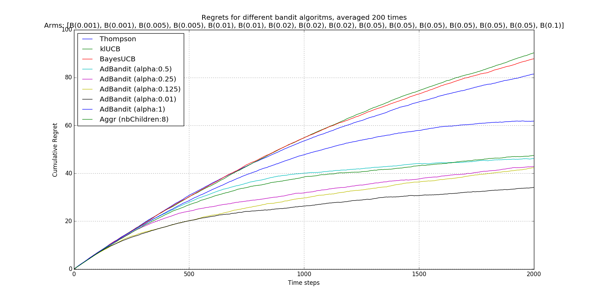
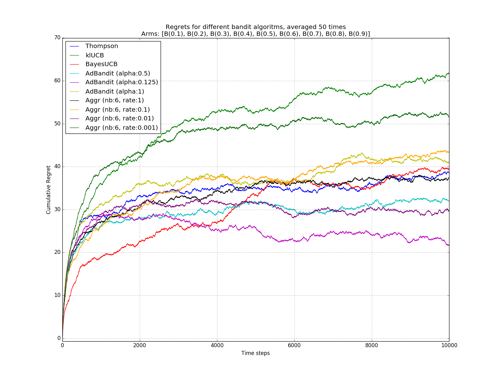
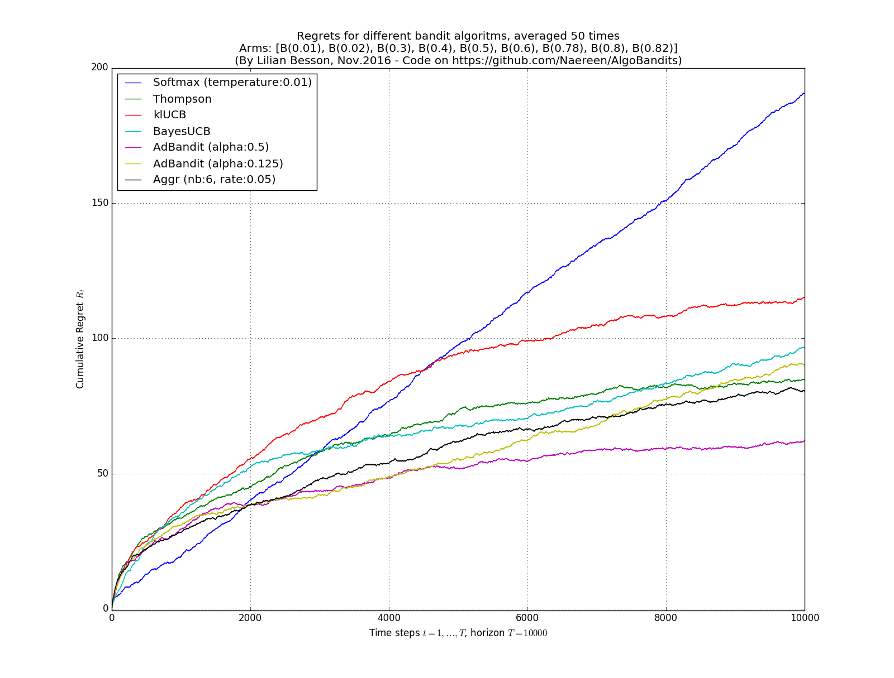
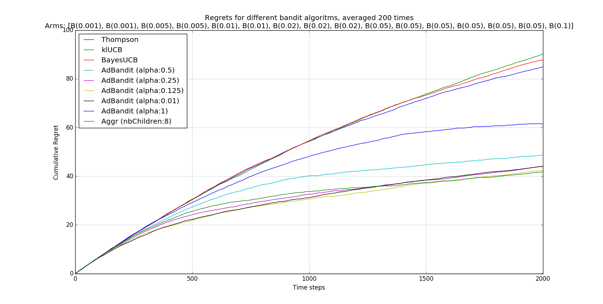
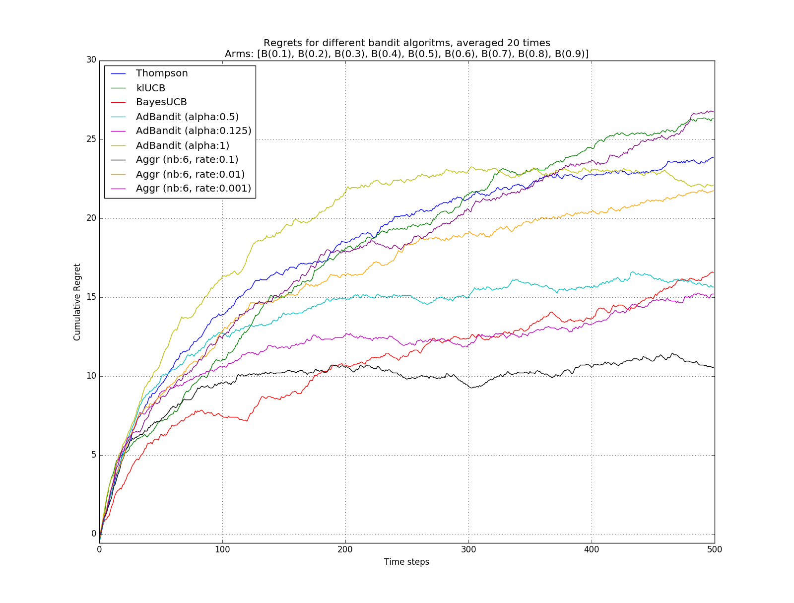
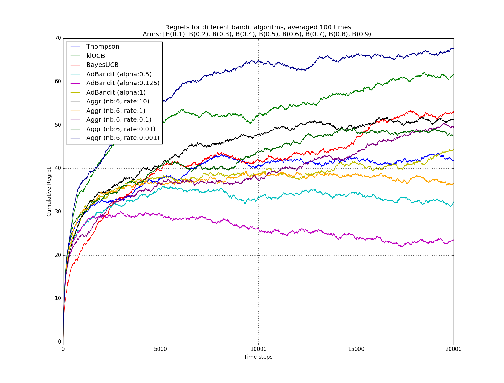
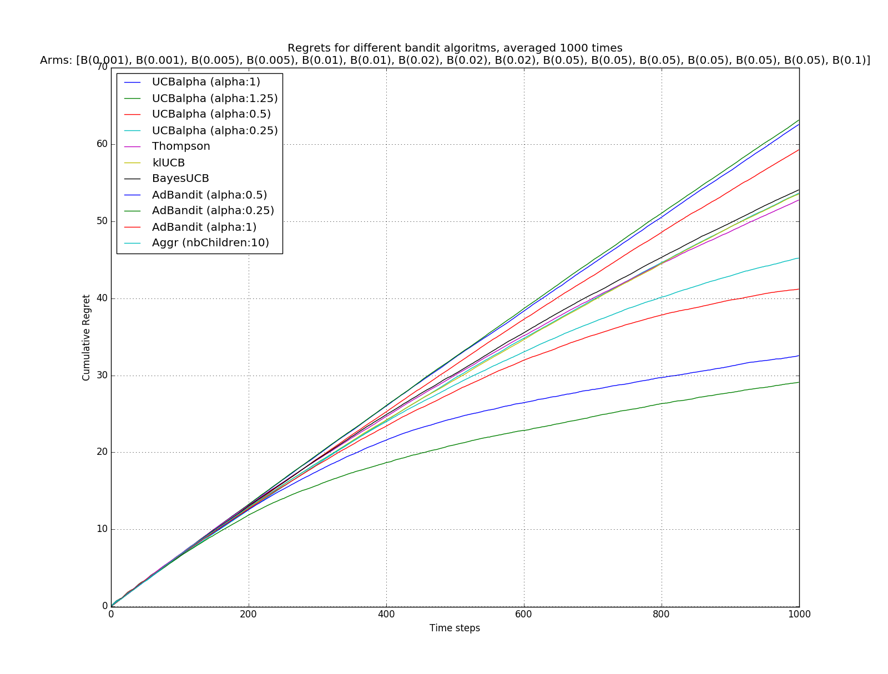

# Bandit algorithms and the aggregated bandit
This repository contains the code for some numerical simulations on *single*-player [Multi-Armed Bandits (MAB)](https://en.wikipedia.org/wiki/Multi-armed_bandit) algorithms.

## The **policy aggregation algorithm**
Specifically, [I (Lilian Besson)](http://perso.crans.org/besson/) designed and added the [`Aggr`](Policies/Aggr.py) policy, in order to test it.

It is a simple **voting algorithm to combine multiple bandit algorithms into one**.
Basically, it behaves like the simple [Thompson sampling](https://en.wikipedia.org/wiki/Thompson_sampling), where arms are the child algorithms `A_1 .. A_N`, each running in "parallel".

### More mathematical explanations
Initially, every child algorithms `A_i` has the same "trust" probability `p_i`, and at every step, the aggregated bandit first listen to the decision from all its children `A_i` (`a_{i,t}` in `1 .. K`), and then decide which arm to select by a probabilistic vote: the probability of selecting arm `k` is the sum of the trust probability of the children who voted for arm `k`.
It could also be done the other way: the aggregated bandit could first decide which children to listen to, then trust him.

But we want to update the trust probability of all the children algorithms, not only one, when it was wised to trust them.
Mathematically, when the aggregated arm choose to pull the arm `k` at step `t`, if it yielded a positive reward `r_{k,t}`, then the probability of all children algorithms `A_i` who decided (independently) to chose `k` (i.e., `a_{i,t} = k`) are increased multiplicatively: `p_i <- p_i * exp(+ beta * r_{k,t})` where `beta` is a positive *learning rate*, e.g., `beta = 0.1`.

It is also possible to decrease multiplicatively the trust of all the children algorithms who did not decided to chose the arm `k` at every step `t`: if  `a_{i,t} != k` then `p_i <- p_i * exp(- beta * r_{k,t})`. I did not observe any difference of behavior between these two options (implemented with the Boolean parameter `updateAllChildren`).

### Ensemble voting for MAB algorithms
This algorithm can be seen as the Multi-Armed Bandits (i.e., sequential reinforcement learning) counterpart of an *ensemble voting* technique, as used for classifiers or regression algorithm in usual supervised machine learning (see, e.g., [`sklearn.ensemble.VotingClassifier`](http://scikit-learn.org/stable/modules/generated/sklearn.ensemble.VotingClassifier.html#sklearn.ensemble.VotingClassifier) in [scikit-learn](http://scikit-learn.org/)).

Another approach could be to do some sort of [grid search](http://scikit-learn.org/stable/modules/grid_search.html).

----

## Remarks
- [joblib](https://pythonhosted.org/joblib/) is used for the [`Evaluator`](Environment/Evaluator.py) class, so the simulations can easily be parallelized. (Put `n_jobs = -1` or `PARALLEL = True` to use all your CPU cores, as it is by default).
- Most of the code comes from the [pymabandits](http://mloss.org/software/view/415/) project, but some of them were refactored. Thanks to the initial project!
- This work is still in its early stage of development!
- This aggregated bandit algorithm has NO THEORETICAL warranties what so ever - yet.

----

## Configuration:
A simple python file, [`configuration.py`](configuration.py), is used to import the [arm classes](Arms/), the [policy classes](Policies/) and define the experiments.

For example, this will compare the [`UCB`](Policies/UCB.py), [`Thompson`](Policies/Thompson.py), [`BayesUCB`](Policies/BayesUCB.py), [`klUCB`](Policies/klUCB.py), and the less classical [`AdBandit`](Policies/AdBandit.py) algorithms.

```python
configuration = {
    # Finite horizon of the simulation
    "horizon": 10000,
    # number of repetitions
    "repetitions": 100,
    # Maximum number of cores for parallelization
    "n_jobs": -1,
    # Verbosity for the joblib calls
    "verbosity": 5,
    # Environment configuration, you can set up more than one.
    "environment": [
        {
            "arm_type": Bernoulli,  # Only Bernoulli is available as far as now
            "probabilities": [0.02, 0.02, 0.02, 0.10, 0.05, 0.05, 0.05, 0.01, 0.01, 0.01]
        }
    ],
    # Policies that should be simulated, and their parameters.
    "policies": [
        {
            "archtype": UCB,
            "params": {}
        },
        {
            "archtype": Thompson,
            "params": {}
        },
        {
            "archtype": klUCB,
            "params": {}
        },
        {
            "archtype": BayesUCB,
            "params": {}
        },
        {
            "archtype": AdBandit,
            "params": {
                "alpha": 0.5,
                "horizon": 10000  # AdBandit require to know the horizon
            }
        }
    ]
}
```

To add an aggregated bandit algorithm ([`Aggr` class](Policies/Aggr.py)), you can use this piece of code, to aggregate all the algorithms defined before:
```python
current_policies = configuration["policies"]
configuration["policies"] = current_policies +
    [{  # Add one Aggr policy, from all the policies defined above
        "archtype": Aggr,
        "params": {
            "learningRate": 0.05,  # Tweak this if needed
            "updateAllChildren": True,
            "children": current_policies,
        },
    }]
```

----

## How to run the experiments ?
First, install the requirements:
```bash
pip install -r requirements.txt
```

Then it should be very straight forward to run some experiment.
This will plot run the simulation, average them (by `repetitions`) and plot the results:
```bash
python main.py
```

### Or with a [`Makefile`](Makefile) ?
You can also use the provided [`Makefile`](Makefile) file to do this simply:
```bash
make install  # install the requirements
make run      # run and log the main.py script
```

It can be used to check [the quality of the code](pylint.log.txt) with [pylint](https://www.pylint.org/):
```bash
make lint lint3  # check the code with pylint
```

----

## Some illustrations
Here are some plots illustrating the performances of the different [policies](Policies/) implemented in this project, against various problems (with [`Bernoulli`](Arms/Bernoulli.py) arms only):

### Small tests
[](plots/5_tests_AdBandit__et_Aggr.png)
[](plots/2000_steps__100_average.png)

### Larger tests
[](plots/10000_steps__50_repetition_6_policies_4_Aggr.png)
[](plots/10000_steps__50_repetition_6_policies_with_Softmax_1_Aggr.png)

### Some examples where [`Aggr`](Policies/Aggr.py) performs well
[](plots/Aggr_is_the_best_here.png)
[](plots/one_Aggr_does_very_well.png)

### One last example
The [`Aggr`](Policies/Aggr.py) can have a fixed learning rate, whose value has a great effect on its performance, as illustrated here:
[](plots/20000_steps__100_repetition_6_policies_5_Aggr.png)

### One a harder problem
[](plots/example_harder_problem.png)

----

## A note on execution times, speed and profiling.
- About (time) profiling with Python (2 or 3): `cProfile` or `profile` [in Python 2 documentation](https://docs.python.org/2/library/profile.html) ([in Python 3 documentation](https://docs.python.org/2/library/profile.html)), [this StackOverflow thread](https://stackoverflow.com/a/7693928/5889533), [this blog post](https://www.huyng.com/posts/python-performance-analysis), and the documentation of [`line_profiler`](https://github.com/rkern/line_profiler) (to profile lines instead of functions) and [`pycallgraph`](http://pycallgraph.slowchop.com/en/master/) (to illustrate function calls) and [`yappi`](https://pypi.python.org/pypi/yappi/) (which seems to be thread aware).
- See also [`pyreverse`]() to get nice UML-like diagrams illustrating the relationships of packages and classes between each-other.

----

## :boom: TODO
- [x] clean up code, OK
- [x] lint the code and make it "perfect", OK
- [x] pass it to Python 3.5 (while still being valid Python 2.7), OK
- [x] add more arms: Gaussian, Exponential, Poisson, OK
- [x] add my aggregated bandit algorithm, OK
- [ ] explore the behavior of my algorithm, and understand it better (and improve it?)
- [x] In fact, [exhaustive grid search](http://scikit-learn.org/stable/modules/grid_search.html#exhaustive-grid-search) cannot be easily used as it cannot run *on-line*! Sadly OK
- [ ] document all that, at least a little bit
- [ ] add more basic algorithms, e.g., from [this survey](http://homes.di.unimi.it/~cesabian/Pubblicazioni/banditSurvey.pdf) or [this document](http://www.cs.mcgill.ca/~vkules/bandits.pdf)
- [ ] use [hdf5](https://www.hdfgroup.org/HDF5/) with [`h5py`](http://docs.h5py.org/en/latest/quick.html#core-concepts) to store the data, on the run (to never lose data even if the simulation gets killed)
- [ ] implement some algorithms from [this repository](https://github.com/johnmyleswhite/BanditsBook/blob/master/python/algorithms/exp3/exp3.py)
- [ ] keep it on GitHub, then make the repository public
- [ ] implement a multi-player simulation environment as well!

----

## :scroll: License ? [](https://github.com/Naereen/AlgoBandits/blob/master/LICENSE)
[MIT Licensed](https://lbesson.mit-license.org/) (file [LICENSE](LICENSE)).

© 2012 [Olivier Cappé](http://perso.telecom-paristech.fr/%7Ecappe/), [Aurélien Garivier](https://www.math.univ-toulouse.fr/%7Eagarivie/), [Émilie Kaufmann](http://chercheurs.lille.inria.fr/ekaufman/) and for the initial [pymaBandits v1.0](http://mloss.org/software/view/415/) project, and © 2016 [Lilian Besson](https://GitHub.com/Naereen) for the rest.

[](https://GitHub.com/Naereen/AlgoBandits/graphs/commit-activity)
[](https://GitHub.com/Naereen/ama)
[](https://GitHub.com/Naereen/AlgoBandits/)

[](http://ForTheBadge.com)
[](https://GitHub.com/)

[](https://GitHub.com/Naereen/)
