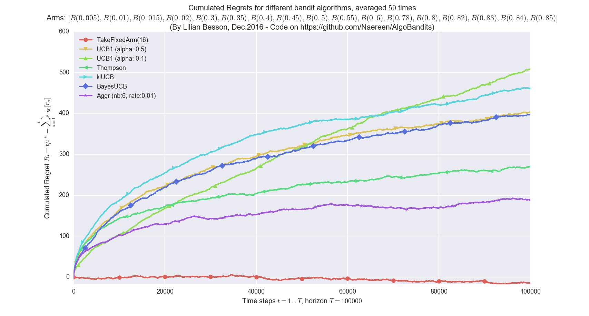
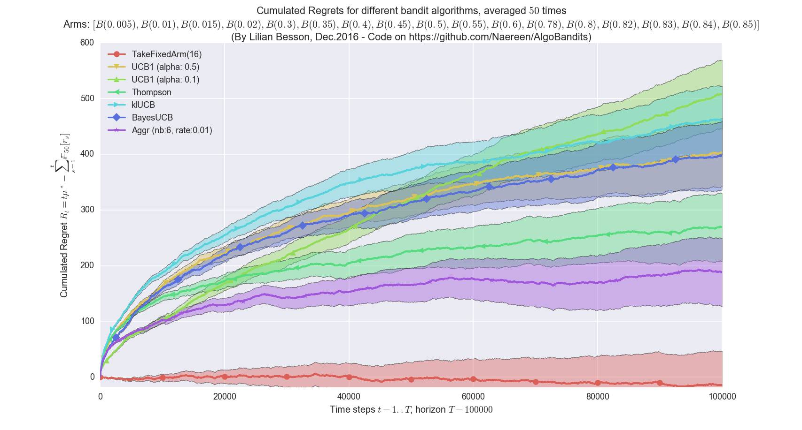
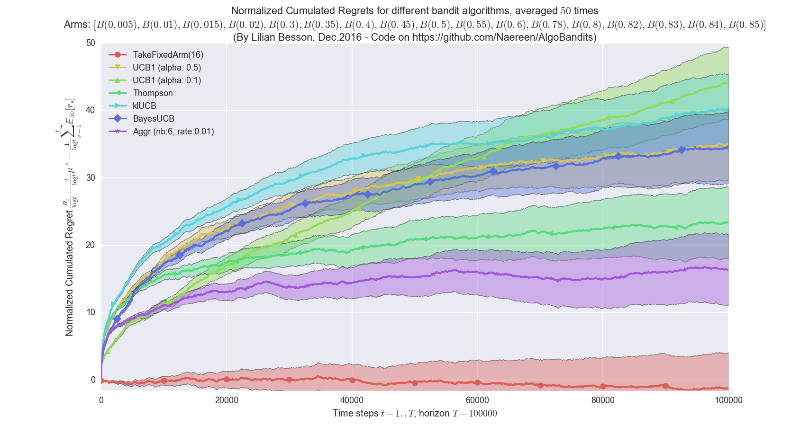
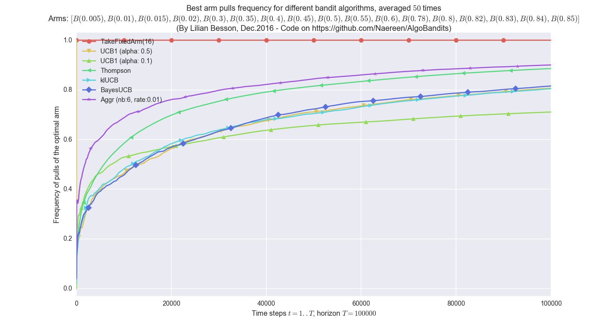

# Some illustrations for [this project](https://github.com/Naereen/AlgoBandits)

Here are some plots illustrating the performances of the different [policies](../Policies/) implemented in this project, against various problems (with [`Bernoulli`](../Arms/Bernoulli.py) arms only):

### (Average) cumulative regret

### (Average) cumulative regret and standard deviation - FIXME

### Normalized cumulative regret

### Best arm pulls frequency

