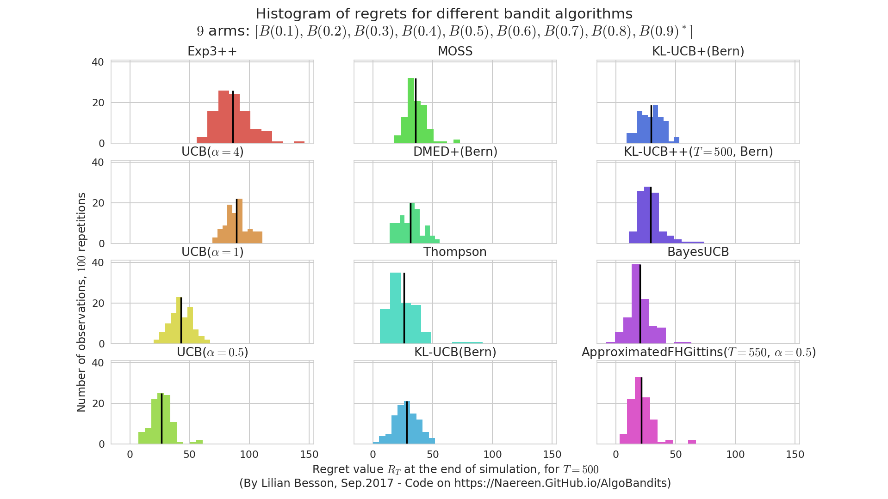
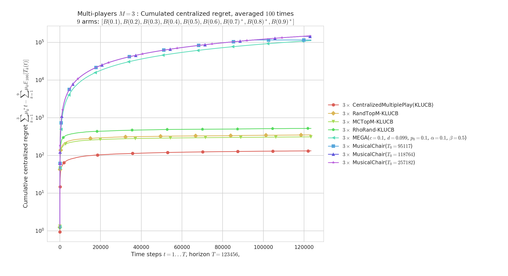
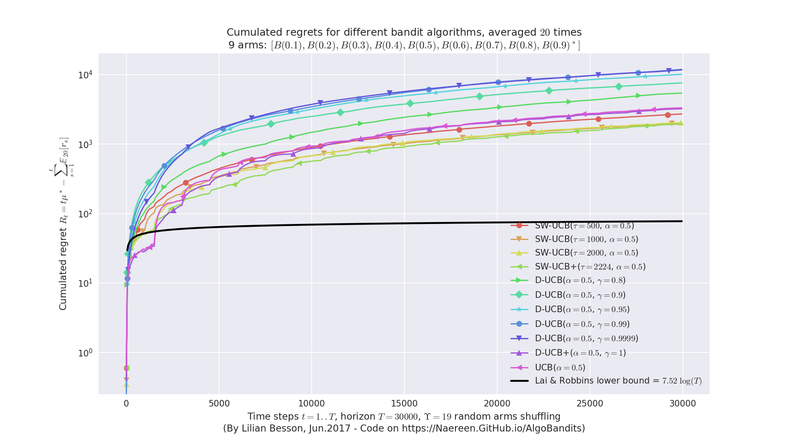
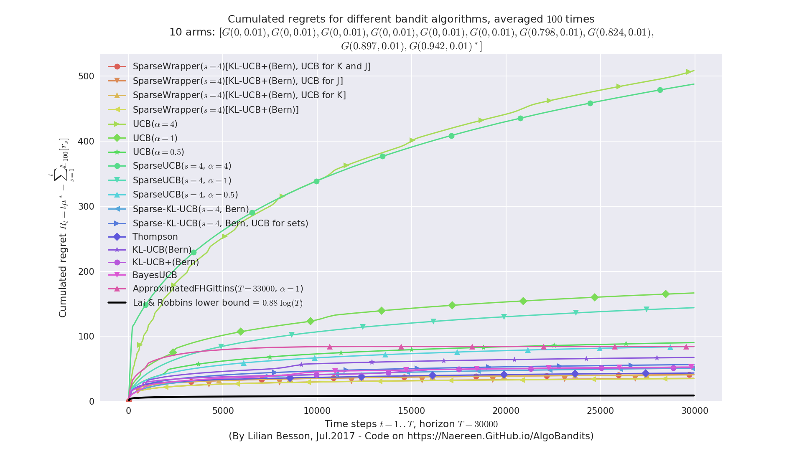
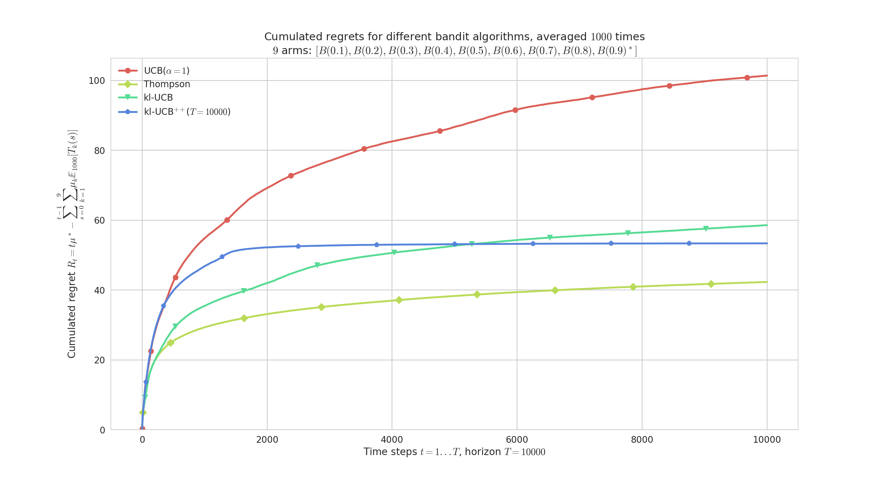
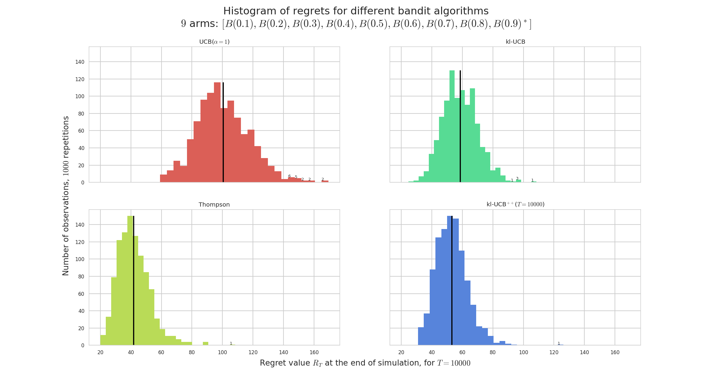
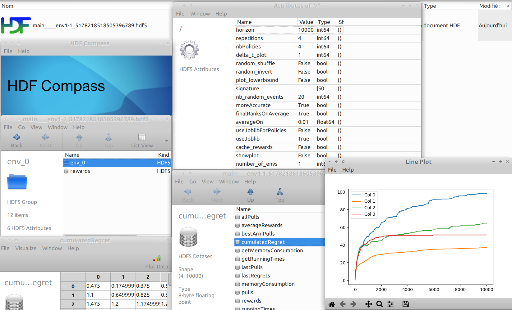
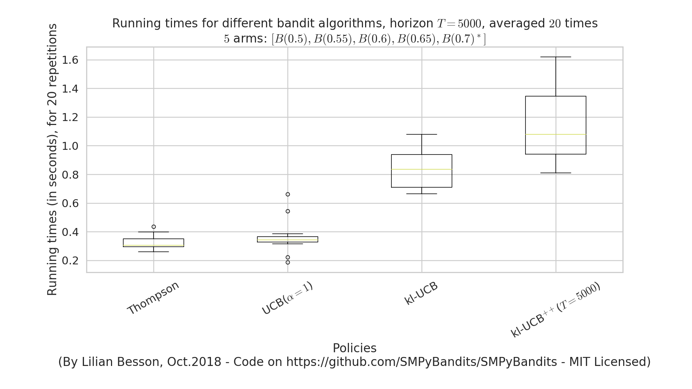
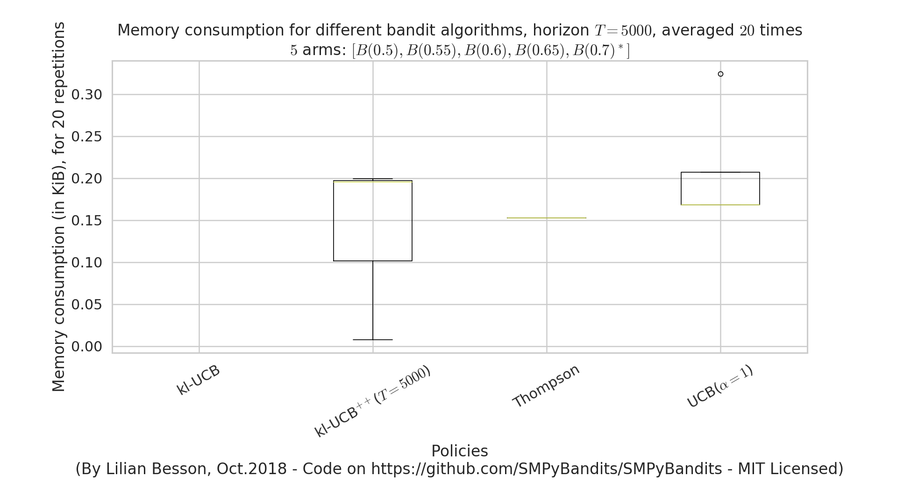

# Some illustrations for [this project](https://github.com/SMPyBandits/SMPyBandits)

Here are some plots illustrating the performances of the different [policies](../SMPyBandits/Policies/) implemented in this project, against various problems (with [`Bernoulli`](../SMPyBandits/Arms/Bernoulli.py) arms only):

## Histogram of regrets at the end of some simulations
On a simple Bernoulli problem, we can compare 16 different algorithms (on a short horizon and a small number of repetitions, just as an example).
If we plot the distribution of the regret at the end of each experiment, `R_T`, we can see this kind of plot:



It helps a lot to see both the mean value (in solid black) of the regret, and its distribution of a few runs (100 here).
It can be used to detect algorithms that perform well in average, but sometimes with really bad runs.
Here, the [Exp3++](../SMPyBandits/Policies/Exp3PlusPlus.py) seems to had one bad run.

---

## Demonstration of different [Aggregation policies](../Aggregation.md)
On a fixed Gaussian problem, aggregating some algorithms tuned for this exponential family (ie, they know the variance but not the means).
Our algorithm, [Aggregator](../SMPyBandits/Policies/Aggregator.py), outperforms its ancestor [Exp4](../SMPyBandits/Policies/Aggregator.py) as well as the other state-of-the-art experts aggregation algorithms, [CORRAL](../SMPyBandits/Policies/CORRAL.py) and [LearnExp](../SMPyBandits/Policies/LearnExp.py).


---

## Demonstration of [multi-player algorithms](../MultiPlayers.md)
Regret plot on a random Bernoulli problem, with `M=6` players accessing independently and in a decentralized way `K=9` arms.
Our algorithms ([RandTopM](../SMPyBandits/PoliciesMultiPlayers/RandTopM.py) and [MCTopM](../SMPyBandits/PoliciesMultiPlayers/RandTopM.py), as well as [Selfish](../SMPyBandits/Policie/Selfish.py)) outperform the state-of-the-art [rhoRand](../SMPyBandits/PoliciesMultiPlayers/rhoRand.py):


Histogram on the same random Bernoulli problems.
We see that some all algorithms have a non-negligible variance on their regrets.


Comparison with two other "state-of-the-art" algorithms ([MusicalChair](../SMPyBandits/Policies/MusicalChair.py) and [MEGA](../SMPyBandits/Policies/MEGA.py), in semilogy scale to really see the different scale of regret between efficient and sub-optimal algorithms):



---

## Other illustrations
### Piece-wise stationary problems
Comparing [Sliding-Window UCB](../SMPyBandits/Policies/SlidingWindowUCB.py) and [Discounted UCB](../SMPyBandits/Policies/DiscountedUCB.py) and [UCB](../SMPyBandits/Policies/UCB.py), on a simple Bernoulli problem which regular random shuffling of the arm.



### Sparse problem and Sparsity-aware algorithms
Comparing regular [UCB](../SMPyBandits/Policies/UCB.py), [klUCB](../SMPyBandits/Policies/klUCB.py) and [Thompson sampling](../SMPyBandits/Policies/Thompson.py) against ["sparse-aware" versions](../SMPyBandits/Policies/SparseWrapper.py), on a simple Gaussian problem with `K=10` arms but only `s=4` with non-zero mean.



---

## Demonstration of the [Doubling Trick policy](../DoublingTrick.md)
- On a fixed problem with full restart:
  

- On a fixed problem with no restart:
  

- On random problems with full restart:
  

- On random problems with no restart:
  

---

## Plots for the [JMLR MLOSS](http://jmlr.org/mloss/) paper

In [the JMLR MLOSS paper](../paper/paper.md) I wrote to present SMPyBandits,
an example of a simulation is presented, where we compare the standard anytime [`klUCB`](https://SMPyBandits.GitHub.io/docs/Policies.klUCB.html) algorithm against the non-anytime variant [`klUCBPlusPlus`](https://SMPyBandits.GitHub.io/docs/Policies.klUCBPlusPlus.html) algorithm, and also [`UCB`](https://SMPyBandits.GitHub.io/docs/Policies.UCBalpha.html) (with \(\alpha=1\)) and [`Thompson`](https://SMPyBandits.GitHub.io/docs/Policies.Thompson.html) (with [Beta posterior](https://SMPyBandits.GitHub.io/docs/Policies.Posterior.Beta.html)).

```python
configuration["policies"] = [
  { "archtype": klUCB, "params": { "klucb": klucbBern } },
  { "archtype": klUCBPlusPlus, "params": { "horizon": HORIZON, "klucb": klucbBern } },
  { "archtype": UCBalpha, "params": { "alpha": 1 } },
  { "archtype": Thompson, "params": { "posterior": Beta } }
]
```

Running this simulation as shown below will save figures in a sub-folder, as well as save data (pulls, rewards and regret) in [HDF5 files](http://docs.h5py.org/en/stable/high/file.html).

```bash
# 3. run a single-player simulation
$ BAYES=False ARM_TYPE=Bernoulli N=1000 T=10000 K=9 N_JOBS=4 \
  MEANS=[0.1,0.2,0.3,0.4,0.5,0.6,0.7,0.8,0.9] python3 main.py configuration.py
```

The two plots below shows the average regret for these 4 algorithms.
The regret is the difference between the cumulated rewards of the best fixed-armed strategy (which is the oracle strategy for stationary bandits), and the cumulated rewards of the considered algorithms.

- Average regret:
  

- Histogram of regrets:
  

> Example of a single-player simulation showing the average regret and histogram of regrets of 4 algorithms. They all perform very well: each algorithm is known to be order-optimal (*i.e.*, its regret is proved to match the lower-bound up-to a constant), and each but UCB is known to be optimal (*i.e.* with the constant matching the lower-bound). For instance, Thomson sampling is very efficient in average (in yellow), and UCB shows a larger variance (in red).

### Saving simulation data to HDF5 file

This simulation produces this example HDF5 file,
which contains attributes (*e.g.*, `horizon=10000`, `repetitions=1000`, `nbPolicies=4`),
and a collection of different datasets for each environment.
Only one environment was tested, and for `env_0` the HDF5 stores some attributes (*e.g.*, `nbArms=9` and `means=[0.1,0.2,0.3,0.4,0.5,0.6,0.7,0.8,0.9]`)
and datasets (*e.g.*, `bestArmPulls` of shape `(4, 10000)`, `cumulatedRegret` of shape `(4, 10000)`, `lastRegrets` of shape `(4, 1000)`, `averageRewards` of shape `(4, 10000)`).
See the example:
[GitHub.com/SMPyBandits/SMPyBandits/blob/master/plots/paper/example.hdf5](https://github.com/SMPyBandits/SMPyBandits/blob/master/plots/paper/example.hdf5).

> Note: [HDFCompass](https://github.com/HDFGroup/hdf-compass) is recommended to explore the file from a nice and easy to use GUI. Or use it from a Python script with [h5py](http://docs.h5py.org/en/stable/index.html) or a Julia script with [HDF5.jl](https://github.com/JuliaIO/HDF5.jl).
> 

---

## Graph of time and memory consumptions
### Time consumption
Note that [I had added a very clean support](https://github.com/SMPyBandits/SMPyBandits/issues/94) for time consumption measures, every simulation script will output (as the end) some lines looking like this:

```
Giving the mean and std running times ...
For policy #0 called 'UCB($\alpha=1$)' ...
    84.3 ms ± 7.54 ms per loop (mean ± std. dev. of 10 runs)
For policy #1 called 'Thompson' ...
    89.6 ms ± 17.7 ms per loop (mean ± std. dev. of 10 runs)
For policy #3 called 'kl-UCB$^{++}$($T=1000$)' ...
    2.52 s ± 29.3 ms per loop (mean ± std. dev. of 10 runs)
For policy #2 called 'kl-UCB' ...
    2.59 s ± 284 ms per loop (mean ± std. dev. of 10 runs)
```



### Memory consumption
Note that [I had added an experimental support](https://github.com/SMPyBandits/SMPyBandits/issues/129) for time consumption measures, every simulation script will output (as the end) some lines looking like this:

```
Giving the mean and std memory consumption ...
For players called '3 x RhoRand-kl-UCB, rank:1' ...
    23.6 KiB ± 52 B (mean ± std. dev. of 10 runs)
For players called '3 x RandTopM-kl-UCB' ...
    1.1 KiB ± 0 B (mean ± std. dev. of 10 runs)
For players called '3 x Selfish-kl-UCB' ...
    12 B ± 0 B (mean ± std. dev. of 10 runs)
For players called '3 x MCTopM-kl-UCB' ...
    4.9 KiB ± 86 B (mean ± std. dev. of 10 runs)
For players called '3 x MCNoSensing($M=3$, $T=1000$)' ...
    12 B ± 0 B (mean ± std. dev. of 10 runs)
```



> It is still experimental!

----

### :scroll: License ? [](https://github.com/SMPyBandits/SMPyBandits/blob/master/LICENSE)
[MIT Licensed](https://lbesson.mit-license.org/) (file [LICENSE](LICENSE)).

© 2016-2018 [Lilian Besson](https://GitHub.com/Naereen).

[](https://github.com/SMPyBandits/SMPyBandits/)
[](https://GitHub.com/SMPyBandits/SMPyBandits/graphs/commit-activity)
[](https://GitHub.com/Naereen/ama)
[](https://GitHub.com/SMPyBandits/SMPyBandits/)


[](https://SMPyBandits.ReadTheDocs.io/en/latest/?badge=latest)
[](https://travis-ci.org/SMPyBandits/SMPyBandits)
[](https://GitHub.com/SMPyBandits/SMPyBandits/stargazers)
[](https://github.com/SMPyBandits/SMPyBandits/releases)
